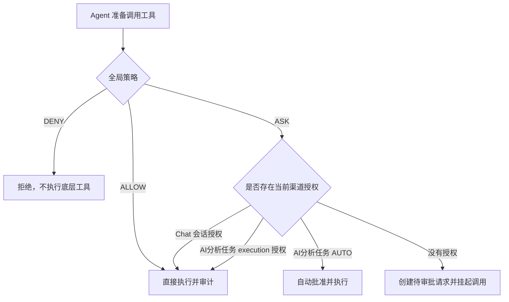

# MCP 审批与 AI分析任务快速上手

本文面向第一次接触 ZenVis DIH 的产品、测试、前端和后端同事，说明 MCP 工具权限、聊天内审批、Skill 和后台 AI分析任务之间的关系，以及最短的验证和扩展路径。

更底层的实现与数据结构见 [MCP Client 与业务 Agent 工具集成设计说明](MCP-Client-Agent-Design.md)，完整接口见 [ChatController](../api接口文档/ChatController.md)、[McpController](../api接口文档/McpController.md)、[AnalysisTaskController](../api接口文档/AnalysisTaskController.md) 和 [SkillController](../api接口文档/SkillController.md)。

## 1. 先理解四个概念

| 概念 | 解决的问题 | 管理入口 |
|---|---|---|
| MCP 服务 | 连接外部系统并发现其工具 | 服务管理 → MCP 服务 |
| MCP 工具策略 | 决定工具直接执行、需要审批还是禁止 | MCP 服务 → 工具审批策略 |
| Skill | 向 Agent 注入业务规则、流程和知识提示 | DIH Skill 管理；AI分析任务创建时可选 |
| AI分析任务 | 在后台持续运行一次 Agent 分析，可定时、排队和审批 | 服务管理 → AI分析任务 |

MCP 是“可执行能力”，Skill 是“如何思考和使用能力的说明”。Skill 本身不会绕过 MCP 策略。

## 2. 权限判定总原则

每个工具都有一个全局有效策略：

- `ALLOW`：直接执行并记录审计。
- `ASK`：根据调用渠道进入聊天审批、任务审批或普通审批队列。
- `DENY`：底层工具永远不执行，并且不会注入 Agent 可用工具集。

工具唯一键：

```text
本地工具：local::<toolName>
外部工具：external::<serverId>::<originalToolName>
```

判定顺序固定为：



全局 `DENY` 优先级最高，聊天会话授权、任务授权和 `AUTO` 都不能覆盖它。

### 默认策略如何产生

- 本地查询、列表、详情、统计、校验、模拟类工具通常声明为 `ALLOW`。
- 本地写入、删除、执行、任务触发类工具通常声明为 `ASK`。
- 本地工具未声明风险时按 `ASK` 处理。
- 外部 MCP 工具只有 `readOnlyHint=true` 时默认 `ALLOW`，其他情况默认 `ASK`。
- 管理员设置的人工策略覆盖默认策略；“恢复默认”会清除人工覆盖。

## 3. 管理员日常操作

### 3.1 接入外部 MCP 服务

1. 打开“服务管理 → MCP 服务”。
2. 填写服务标识、地址、SSE endpoint 和可选请求头。
3. 启用并刷新连接。
4. 确认连接状态为成功，并能看到工具列表。
5. 到“工具审批策略”检查新发现工具的默认策略。

新工具在服务刷新后自动纳入策略管理，不需要手工建策略记录。外部工具断线后仍可维护人工策略，服务恢复后继续生效。

### 3.2 设置工具策略

策略页支持逐行设置，也支持跨页勾选后批量操作：

- 批量允许：设为 `ALLOW`。
- 批量询问：设为 `ASK`。
- 批量禁止：设为 `DENY`，Agent 不再获得这些工具。
- 批量恢复默认：清除人工策略，重新使用工具声明或 hints 推导的默认值。

策略修改仅超级管理员可执行。批量操作只更新明确勾选的工具，不会隐式更新全部筛选结果。

### 3.3 审批队列与调用审计

- “MCP 审批队列”只展示仍处于 `PENDING` 的请求，用来处理当前工作。
- 审批完成、拒绝、超时、取消、成功和失败记录统一到“MCP 工具调用审计”查看。
- 审计支持按关键字、渠道、策略、状态、审批范围、用户、任务 ID 和 executionId 筛选。
- 参数、结果和错误摘要会脱敏和截断；敏感键不会以原文保存。

普通用户只能查看或处理自己的请求，超级管理员可以代审和查看全量记录。

## 4. DIH Chat 内联审批

聊天调用 `ASK` 工具时，当前流式连接保持打开，审批卡片插入正在生成的 AI 消息中。参数和返回结果由 MCP 调用日志代码块各展示一次；审批卡片只展示工具、来源、风险、描述、倒计时和状态。

卡片提供三种决定：

| 操作 | 生效范围 | 后续相同工具是否再审批 |
|---|---|---|
| 允许本次 | 当前 `requestId` | 是 |
| 本会话始终允许 | 当前用户 + 当前 `chatId` + 精确 `toolKey` | 否，直到聊天被删除 |
| 拒绝执行 | 当前 `requestId` | 下次仍可重新审批 |

注意：

- 会话授权会持久化，刷新页面和服务重启后仍有效。
- 不同用户、chatId 或 toolKey 不能复用授权。
- 停止生成会取消本轮仍在等待的请求，但不会撤销已建立的会话授权。
- 聊天普通审批默认五分钟超时，超时后底层工具不执行。
- 审批、拒绝和超时都会把结构化结果返回给 Agent，因此模型可以继续解释发生了什么。

聊天流新增的 NDJSON 事件：

| 事件 | 用途 |
|---|---|
| `approval_required` | 创建审批卡片 |
| `approval_updated` | 更新批准、执行中、成功、失败、拒绝、超时或取消状态 |

最终消息会保存 `mcp-approval` part，重新打开历史会话时仍能看到工具和决策状态。

## 5. 后台 AI分析任务

AI分析任务是一次性后台 Agent 任务。提交后 HTTP 请求立即返回，浏览器关闭不会中断执行。

### 5.1 创建任务

创建表单需要填写：

- 任务名称和分析提示词。
- 模型：从 `/api/v1/dih/model/list` 获取，与 DIH Chat 的可用模型一致；`auto` 表示系统自动选择。
- 优先级：数值越大越先执行。
- 可选计划执行时间：仅支持一次性时间；不填则进入普通队列。
- 必选 MCP 审批模式：`AUTO` 或 `MANUAL`。
- 可选 Skill：可搜索多选当前已扫描且启用的所有系统 Skill，不受 Agent 类型限制。

### 5.2 调度顺序

- 未到计划时间的任务不会提前执行。
- 已到期的计划任务优先于普通队列。
- 多个计划任务按计划时间、优先级排序。
- 普通任务按优先级降序、创建时间升序执行。
- `app.ai.analysis-task.max-concurrency` 控制正常执行并发数。
- 等待 MCP 审批时任务进入 `WAITING_APPROVAL` 并释放正常执行槽，其他任务可以继续运行。

### 5.3 两种审批模式

| 模式 | 全局 ALLOW | 全局 ASK | 全局 DENY |
|---|---|---|---|
| `AUTO` | 直接执行 | 自动批准，审计范围 `TASK_AUTO` | 禁止 |
| `MANUAL` | 直接执行 | 无限期等待任务审批 | 禁止 |

`MANUAL` 模式的任务审批没有五分钟超时。任务创建人或超级管理员可以在 AI分析任务页面选择：

- `approved`：允许本次。
- `approved_task`：当前 execution 内，这个精确 toolKey 一直允许，审计范围为 `TASK_RUN`。
- `rejected`：只拒绝当前调用，Agent 获得结构化拒绝结果并继续生成分析结果。

“本任务一直允许”不跨任务、不跨工具，也不跨 execution。任务重新入队会生成新的 executionId，旧授权自动失效。

### 5.4 任务状态

```text
PENDING → RUNNING → SUCCESS / FAILED
             ↕
       WAITING_APPROVAL

PENDING / RUNNING / WAITING_APPROVAL
             ↓
         CANCELING → CANCELED
```

| 状态 | 说明 |
|---|---|
| `PENDING` | 等待计划时间或执行槽 |
| `RUNNING` | Agent 正在运行 |
| `WAITING_APPROVAL` | MCP 回调挂起，等待人工决定 |
| `CANCELING` | 已提交取消，等待后台线程退出 |
| `SUCCESS` | 分析结果已保存 |
| `FAILED` | 执行失败，查看 `error_message` |
| `CANCELED` | 已取消，待审批请求和任务授权已清理 |

服务重启时，原 `RUNNING` 和 `WAITING_APPROVAL` execution 会失效，任务生成新 executionId 并从头重新排队。外部有副作用工具可能在重启前已经执行，因此业务工具自身仍应考虑幂等。

## 6. Skill 在 AI分析任务中的行为

任务运行时会组合两类 Skill：

1. 全局启用且声明适用于 `agent_analysis` 的 Skill。
2. 当前任务显式选择且仍为启用状态的 Skill。

任务只保存 Skill ID，不保存内容快照，因此执行时使用最新 `SKILL.md`。创建、编辑、重新入队和实际执行前都会校验 Skill；如果已选 Skill 被停用或删除，任务进入 `FAILED` 并在错误信息中列出具体 Skill，不会静默跳过。

Skill 选项接口：

```http
GET /api/v1/dih/skills/options?enabled=true
```

它返回所有启用 Skill 的 `label`、`value`、`description` 和 `agent_types`，不按 Agent 类型过滤。

## 7. API 速查

### MCP 管理

| 方法 | 路径 | 作用 |
|---|---|---|
| GET | `/api/v1/dih/mcp/tools/policies/list` | 工具策略分页列表 |
| POST | `/api/v1/dih/mcp/tools/policies/update` | 更新单工具策略 |
| POST | `/api/v1/dih/mcp/tools/policies/bulk-update` | 批量更新策略 |
| GET | `/api/v1/dih/mcp/approvals/list` | 当前待审批队列 |
| POST | `/api/v1/dih/mcp/approvals/{requestId}/decision` | 通用审批决定 |
| GET | `/api/v1/dih/mcp/invocations/list` | 调用审计 |

### AI分析任务

| 方法 | 路径 | 作用 |
|---|---|---|
| POST | `/api/v1/system/analysis-task/add` | 创建并排队 |
| POST | `/api/v1/system/analysis-task/{id}/update` | 完整更新任务配置 |
| POST | `/api/v1/system/analysis-task/{id}/enqueue` | 新 execution 重新入队 |
| POST | `/api/v1/system/analysis-task/{id}/cancel` | 取消等待或运行任务 |
| POST | `/api/v1/system/analysis-task/queue/run-once` | 认领一个到期任务并异步提交 |
| GET | `/api/v1/system/analysis-task/queue/status` | 队列、执行槽和挂起容量 |
| GET | `/api/v1/system/analysis-task/{id}/approvals/list` | 当前 execution 待审批请求 |
| POST | `/api/v1/system/analysis-task/{id}/approvals/{requestId}/decision` | 任务审批决定 |

创建示例：

```json
{
  "name": "每日风险分析",
  "description": "汇总风险趋势并给出处置建议",
  "model": "auto",
  "prompt": "分析最近24小时的高风险事件、变化趋势和建议。",
  "priority": 50,
  "scheduled_time": null,
  "approval_mode": "MANUAL",
  "skill_ids": ["analysis-agent"]
}
```

## 8. 新增工具和 Skill

### 8.1 新增本地 MCP 工具

1. 使用 Spring AI `@Tool` 声明工具。
2. 使用 `@McpToolApproval` 明确默认策略和风险等级。
3. 确认工具注册到了相应 `ToolCallbackProvider`。
4. 启动或刷新后，在策略页确认出现 `local::<toolName>`。
5. 验证 `ALLOW`、`ASK`、`DENY` 三条路径，特别确认拒绝时底层方法没有执行。

不要只依赖工具名称推导风险。未声明工具会按安全默认值 `ASK` 处理，并应由测试阻止遗漏进入生产。

### 8.2 接入新的外部工具

外部工具随 MCP 服务 `listTools` 自动扫描。建议服务端正确声明 `readOnlyHint`、`destructiveHint`、`idempotentHint` 等 hints。刷新服务后检查默认策略和风险，再按业务需要设置人工策略。

### 8.3 新增 Skill

```text
deploy/open_config/skill_config/<skill-id>/
  skill.json
  SKILL.md
```

在 `skill.json` 中配置唯一 ID、名称、入口文件、启用状态和可选 Agent 类型，然后调用 Skill 重载接口。只有扫描成功且 `enabled=true` 的 Skill 才会出现在 AI分析任务选择器中。

## 9. 配置项

```properties
# MCP 总开关与聊天/普通调用审批超时
app.ai.mcp.enabled=true
app.ai.mcp.approval.timeout-seconds=300

# Agent 可见的外部 MCP 服务范围
app.ai.mcp.agent-scopes.default=*
app.ai.mcp.agent-scopes.agent_data_visualization=none

# AI分析任务调度
app.ai.analysis-task.max-concurrency=1
app.ai.analysis-task.max-suspended=20
app.ai.analysis-task.dispatch-delay-ms=5000
```

普通问答 `ask` 不使用 MCP 工具，`app.ai.mcp.agent-scopes.ask` 不产生效果；上述 scope 仅应用于业务 Agent。

`max-suspended` 是允许同时挂起等待审批的任务容量；`dispatch-delay-ms` 是调度轮询间隔，不是任务执行超时。

## 10. 最小验收流程

1. 选择一个无副作用工具设为 `ALLOW`，聊天调用时应直接执行且不出现卡片。
2. 将同一工具设为 `ASK`，验证“允许本次”后本轮继续，下一次仍出现审批。
3. 验证“本会话始终允许”后同一 chatId 再次调用不出现审批卡片。
4. 设为 `DENY`，确认底层工具不执行。
5. 创建 `AUTO` AI分析任务，确认 `ASK` 工具审计范围为 `TASK_AUTO`。
6. 创建 `MANUAL` AI分析任务，确认状态进入 `WAITING_APPROVAL`，审批后继续。
7. 选择“本任务一直允许”，确认当前 execution 后续同工具不再审批。
8. 停用任务已选 Skill，再执行任务，确认任务失败并显示 Skill 名称。
9. 在调用审计中按任务 ID 和 executionId 找到完整记录。

## 11. 常见问题

### 创建 AI分析任务时没有可选模型

先访问 `GET /api/v1/dih/model/list`。模型下拉框与 DIH Chat 共用此接口；如果接口无数据或返回无权限，检查 OpenAI 兼容服务配置、API Key 和当前登录状态。

### 新增 MCP 工具没有进入策略页

- 本地工具：确认已经注册为 Spring AI ToolCallback。
- 外部工具：确认服务已启用、连接成功并执行过刷新。
- 查看 `available` 和最后发现时间；断线工具仍会保留历史策略记录。

### 聊天没有出现审批卡片

依次检查：全局策略是否确实为 `ASK`、工具是否被 Agent scope 过滤、当前 chatId 是否已有会话授权，以及工具是否实际被模型选择调用。

### AI分析任务一直是 PENDING

检查计划时间、可用执行槽、调度器配置以及等待审批任务是否达到 `max-suspended`。可调用 `queue/status` 查看 `ready_count`、`available_slots` 和 `waiting_approval_count`。

### AI分析任务一直等待审批

任务 `MANUAL` 审批是无限期的，不会被聊天五分钟超时任务清理。任务创建人或超级管理员需要在任务详情中处理；也可以取消整个任务。

### 审批完成后去哪里看记录

审批队列只保留待处理项。所有终态记录都在“MCP 工具调用审计”，参数和结果使用 JSON 视图展示。

## 12. 关键实现位置

| 能力 | 代码或配置 |
|---|---|
| 统一策略与审批执行 | `service/dih/mcp/McpApprovalService.java` |
| 工具发现与策略 | `service/dih/mcp/McpToolPolicyService.java` |
| Agent 工具注入 | `service/dih/mcp/AgentMcpToolService.java` |
| Chat 审批事件 | `service/dih/DihChatApplicationService.java` |
| 后台任务调度 | `service/system/impl/AnalysisTaskServiceImpl.java` |
| Skill 扫描与加载 | `service/dih/agent/skill/SkillService.java` |
| MCP AMIS 页面 | `deploy/open_config/mcp_config/index.json` |
| AI分析任务 AMIS 页面 | `deploy/open_config/analysis-task_config/index.json` |
