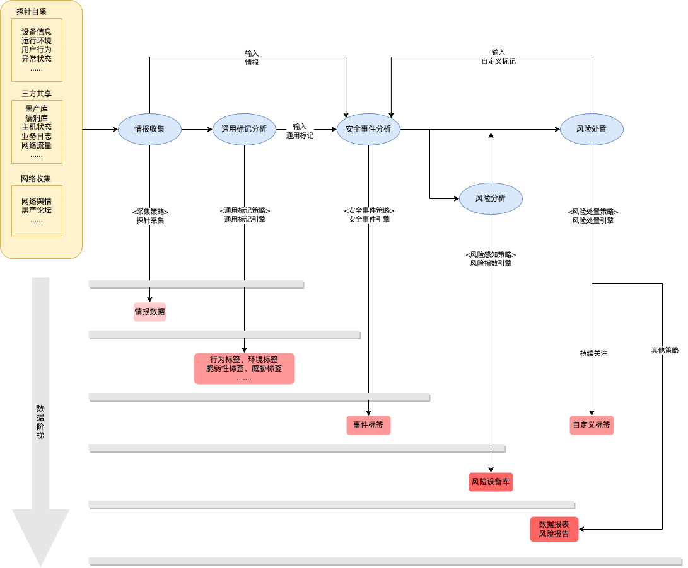

# 产品思路

## 关键概念定义

**探针**：集成到应用程序的安全SDK，用于采集提供检测和分析安全威胁和攻击行为所需要的基础数据

**情报**：多方面采集的能够用于威胁识别、安全事件分析、风险分析预测的基础信息

**探针自采**：情报数据来源之一，探针自己采集的数据

**三方共享**：情报数据来源之二，其他平台推送来或者导入到系统的库等数据

**网络收集**：情报数据来源之三，网上采集的相关舆情数据

**标签**：为设备做标记的结果，生命周期可以是某次启动也可以是整个设备

**标记**：动词，产生标签的动作

**威胁**：对单条情报分析后识别出的特定类型攻击的工具或手段，是否真的有风险具有不确定性

**安全事件**：汇总情报和所有标签信息后，经过攻击序列、组合等关系进一步生成的事件，形成一套完整的攻击链

**通用标签**：基于威胁情报标记的标签，包含行为标签、环境标签、脆弱性标签、威胁标签等

**安全事件标签**：安全事件产生的标签

**自定义标签**：人工分析后打标，或者定制的安全分析服务打标

**风险**：风险是指在恶意利用威胁时面临损失或破坏的可能性，用于概率上，产品中主要用于标签的风险等级划分（高、中、低）

**风险分析**：针对情报、标签等信息分析风险存在的可能性，并根据不同的业务需求进行风险评级

**风险处置**：针对情报、标签、以及风险分析的结果做的响应

**安全分析服务**：秒级响应的设备查询接口，查询设备安全风险信息，对接数据中心完成数据分析以及定制化的功能开发，服务支持等

## 概念关系说明

对终端**多来源信息**采集并分析后，以设备或启动为中心标记**通用标签**、**事件标签**、**自定义标签**，并根据结果进行相关**风险分析**和**风险处置**，定向的为客户提供数据的**安全分析服务**

> 根据系统主线的四个过程划分：情报收集->标签判定（通用标签、安全事件标签、自定义标签）->风险分析、风险处置
>
> 每一个过程产生不同的数据，根据数据阶梯越高可用数据范围越广

