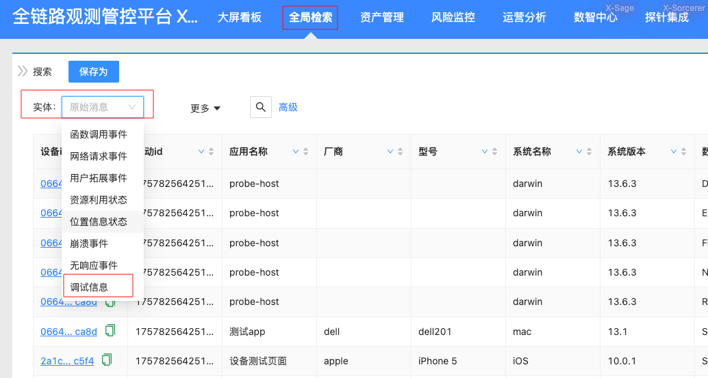
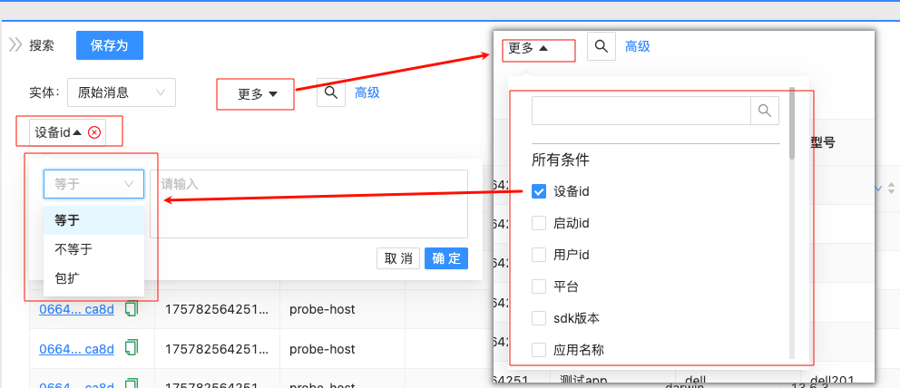
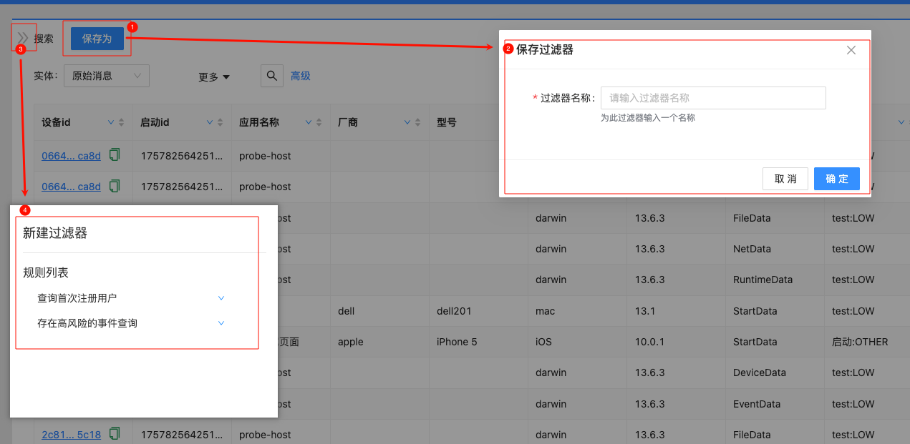
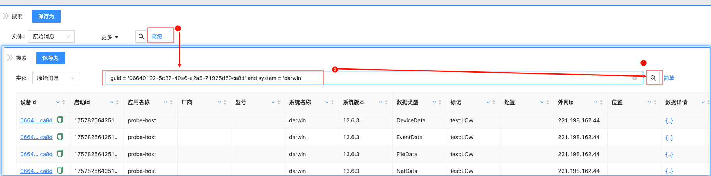
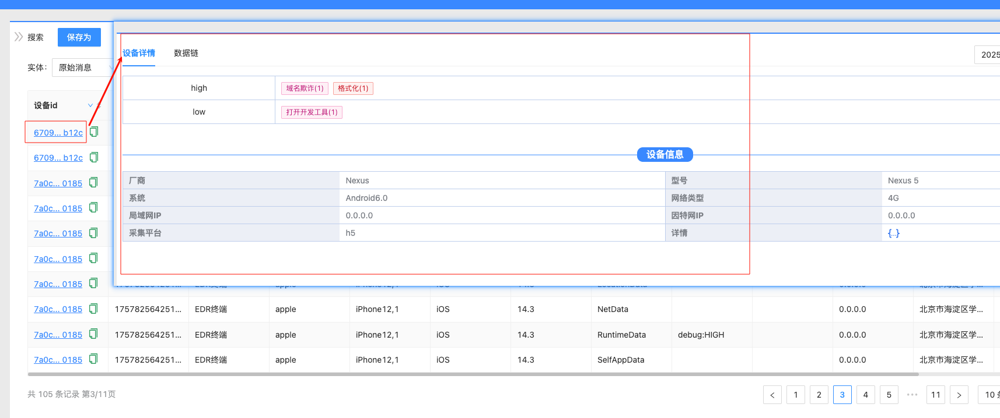

# 全局检索

>全局检索功能是系统的核心查询工具，用于查询系统内所有已注册的实体数据。该功能支持对数据进行筛选、排序、分页、查看详情等操作，帮助用户快速定位和分析所需信息。 
---- 
> **注意**：只有经过元数据配置注册的实体信息才能被检索。  
> 有关元数据配置的详细信息，请参考[元数据配置](功能说明-配置管理?id=元数据配置)

## 功能特点

- **统一入口**：提供单一入口查询系统内所有实体数据
- **多样化检索**：支持快捷检索和高级检索两种模式
- **灵活筛选**：可根据实体属性进行多维度筛选
- **结果管理**：支持排序、分页和条件保存
- **数据汇聚**：支持根据ID汇聚查看相关数据信息

## 使用建议

1. **日常查询**：推荐使用快捷检索，操作简单直观
2. **复杂查询**：推荐使用高级检索，可编写复杂查询条件
3. **常用条件**：建议保存常用检索条件，提高工作效率
4. **权限注意**：检索结果受用户权限控制，只能查看有权限访问的数据

# 快捷检索

快捷检索提供图形化界面操作，适合日常快速查询使用。用户可以通过直观的界面选择要检索的实体类型和检索条件。

## 使用步骤

1. 进入全局检索页面
2. 选择要检索的实体类型
3. 设置检索条件
4. 执行检索操作

检索界面示例如下：

## 筛选功能

根据元数据配置的信息，系统提供相应的筛选条件。用户可以根据业务需求选择合适的筛选项进行精确查找。

筛选界面示例如下：

## 条件保存

为了提高工作效率，系统支持将常用的检索条件保存下来，方便后续快速使用。

条件保存界面示例如下：

# 高级检索

高级检索面向技术用户，支持通过类SQL语法进行复杂查询，适合需要执行复杂数据查询和分析的场景。

## 语法说明

高级检索支持标准SQL语法的WHERE子句，用户可以编写复杂的查询条件，包括：
- 多字段组合查询
- 逻辑运算符（AND、OR、NOT）
- 比较运算符（=、!=、>、<、>=、<=）
- 模糊匹配（LIKE）
- 范围查询（BETWEEN）
- 集合查询（IN、NOT IN）

## 使用示例

高级检索界面示例如下：

# 数据详情

检索结果支持根据ID进行数据汇聚查看，用户可以查看数据的详细信息，包括数据标签、数据链路关系等相关信息。

## 查看内容

数据详情页面展示以下信息：
- 实体基本信息
- 数据标签信息
- 数据链路关系
- 关联实体信息
- 操作历史记录

数据详情界面示例如下：

