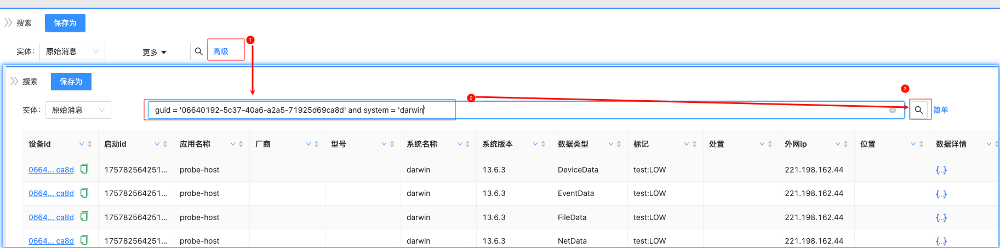
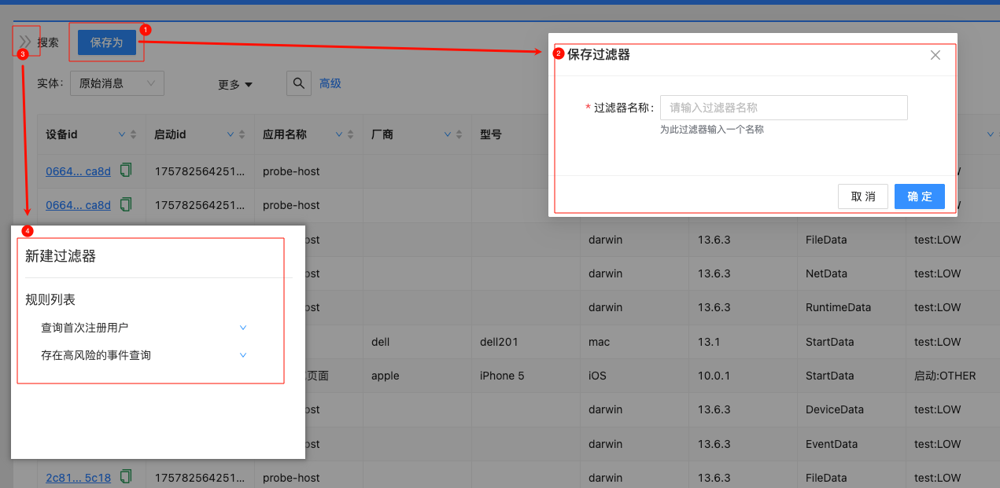

# 全局检索

全局检索用于统一查询 ZenVis 中已经注册为“实体”的数据。用户可以组合普通条件或高级表达式、选择结果字段、分页排序，并把常用配置保存为个人过滤器。

> 只有通过元数据配置注册的实体和字段才能检索。新增数据表后，仅创建表或写入数据不会自动出现在全局检索中。

## 1. 核心概念

| 概念 | 说明 |
| :--- | :--- |
| 实体 | 一类可检索数据，例如资产、事件或告警 |
| 检索字段 | 可用于普通条件或高级表达式的逻辑字段 |
| 展示字段 | 查询结果表格中需要显示的列 |
| 过滤器 | 保存后的实体、条件和展示字段组合 |
| 失效项 | 元数据变化或旧格式规则带来的不可执行配置 |

当前一次查询只支持一个实体，展示字段也必须属于同一实体。

## 2. 功能特点

- 普通检索：使用字段、操作符和值组成条件，不需要编写表达式。
- 高级检索：使用受限 where 表达式表达括号和 AND/OR 组合。
- 展示列管理：可选择需要显示的字段，并支持分页和排序。
- 个人过滤器：保存、更新、删除常用条件，过滤器仅本人可见。
- 元数据漂移提示：实体或字段改名、删除后，不静默丢弃原规则，而是显示具体失效项。
- 自动补全：元数据启用后，部分条件输入框会提供候选建议。

检索主界面示例：


## 3. 快速开始

1. 进入“全局检索”。
2. 选择实体。
3. 保持“简单”模式，选择字段和操作符。
4. 输入条件值；需要更多条件时点击“添加条件”。
5. 在结果表头的展示列入口中确认至少保留一个字段。
6. 点击“搜索”。
7. 需要复用时点击“保存为”，填写过滤器名称。

实体切换后，页面会清空上一个实体的条件、展示列、排序、分页和结果，再加载新实体配置，避免不同实体字段混用。

## 4. 普通检索

普通检索适合日常查询。每个条件由“字段 + 操作符 + 值”组成，多个条件可选择 AND 或 OR：

- AND：所有条件都满足。
- OR：满足任意一个条件。

快捷筛选示例：


常用操作符：

| 页面含义 | 内部操作符 | 说明 |
| :--- | :--- | :--- |
| 等于 / 不等于 | `equal` / `notequal` | 精确比较 |
| 模糊匹配 | `match` | 字符串包含匹配 |
| 大于 / 大于等于 | `greatthan` / `greatequalthan` | 数值或日期比较 |
| 小于 / 小于等于 | `lessthan` / `lessequalthan` | 数值或日期比较 |
| 之间 | `between` | 需要起始值和结束值 |
| 包含 | `in` | 可输入多个值 |
| 为空 / 不为空 | `isnull` / `isnotnull` | 不需要输入值 |

实际可选操作符由当前字段元数据决定。日期输入按系统配置时区解释，默认使用 `Asia/Shanghai`。

## 5. 高级检索

高级检索适合需要括号优先级和复杂 AND/OR 关系的场景。它支持的是 where 表达式安全子集，不是完整 SQL。

示例：

```sql
ip = '10.0.0.1'
`ip` = '10.0.0.1'
attack_state >= 2 and attack_type_name like '%注入%'
module_type_name = '网站攻击' and (attack_type_name = '信息泄露' or attack_type_name = 'SQL注入')
```

支持：

- 逻辑运算：`AND`、`OR`。
- 比较：`= != <> > < >= <=`。
- 模糊匹配：`LIKE`。
- 范围和集合：`BETWEEN`、`IN`。
- 空值判断：`IS NULL`、`IS NOT NULL`。
- 反引号字段名、普通引号和中文智能引号。

不支持：

- `SELECT` 等完整 SQL。
- 子查询和函数调用。
- SQL 注释或分号拼接。
- `1=1` 等没有元数据字段的条件。

安全限制：表达式最长 8 KiB、最多 50 个条件、括号最多 10 层；单个 `IN` 最多 200 个值，单值最长 2 KiB。

高级检索示例：



## 6. 展示字段和结果表格

- 每次查询必须至少选择一个展示字段，最多 100 个。
- 表格列标题使用字段的中文标签，数据绑定使用稳定的逻辑字段名。
- 支持按当前实体字段升序或降序排序。
- 单页支持 1–200 条，页面预设为 10、20、50、100。
- 切换展示列、排序或分页时会重新查询。
- JSON、数组和跳转链接字段会按元数据配置使用对应展示方式。

如果出现“展示字段不存在”，通常表示过滤器保存后元数据字段已经改名或删除，或接口误传了物理数据库列名。请根据失效项重新选择字段。

## 7. 保存和管理过滤器

条件保存示例：



### 7.1 新建

配置好实体、条件和展示字段后点击“保存为”，输入名称并确认。名称、实体、检索模式和至少一个展示字段为必填项。

### 7.2 加载

点击左侧过滤器列表中的规则后，页面会一次加载它的条件、展示字段和当前元数据。有效规则只自动执行一次，不会因条件和字段分批回填而重复查询。

### 7.3 更新

加载已有过滤器并修改后，点击“更新”保存。更新规则：

- 可以修改名称、普通条件、高级表达式或展示字段。
- 清空全部普通条件是有效操作，表示查询该实体全部数据。
- 展示字段不能全部清空。
- 切换实体时必须重新选择新实体的展示字段和条件，不能继承旧实体配置。

### 7.4 删除

删除过滤器不会删除业务数据。删除当前正在使用的过滤器后，页面会清除本地恢复记录并回到新建状态。

### 7.5 个人隔离

过滤器列表、详情、更新、删除和按规则执行都只允许创建者本人访问。其他用户无法看到规则，也无法通过猜测 ID 判断规则是否存在。

这项隔离只针对“保存的过滤器配置”。当前版本尚未定义实体、字段或行级数据权限模型，查询结果范围仍取决于已注册元数据和上游数据源权限。

## 8. 失效过滤器

元数据实体、字段或操作符发生变化时，原过滤器仍保留，但会在列表中标记“失效”和问题数量。

失效过滤器：

- 可以查看、编辑和删除。
- 不会在点击或刷新恢复时自动执行。
- 普通条件中的失效字段可直接移除。
- 失效展示字段可移除或替换，但最终至少保留一个有效展示字段。
- 高级表达式保留原文，需要手工修正字段或语法。
- 旧版本自由 SQL 规则必须改写为普通条件或受限高级表达式。

常见失效项：

| 提示 | 处理方式 |
| :--- | :--- |
| 检索实体不存在 | 选择当前有效实体并重新配置字段 |
| 展示字段不存在 | 移除或替换展示字段 |
| 检索字段不存在 | 普通模式移除条件；高级模式修改表达式 |
| 检索操作符不存在 | 为当前字段重新选择操作符 |
| 高级表达式不正确 | 按安全语法修正表达式 |
| 旧自由 SQL 规则已禁用 | 改写后重新保存 |

## 9. 自动恢复和快速切换

页面缓存最后一次选择的过滤器 ID，但刷新时只自动恢复有效规则：

- 规则有效：恢复并执行一次。
- 规则已删除、无权访问或失效：清除缓存，进入新建状态。

快速连续切换过滤器或实体时，页面会取消旧请求并忽略过期响应，最终结果以最后一次选择为准。被取消的请求不会显示错误提示。

## 10. 常见问题

### 输入条件后文字不显示或立即消失

请确认前端已经包含条件草稿稳定性修复。旧实现会在每次输入后重建条件行，导致输入框丢失文字和焦点。刷新前端资源后再次尝试；如果仍出现，请记录字段、操作符和是否启用自动补全。

### 高级表达式偶发提示操作符不正确

新版解析器已改为每次请求独立状态。如果同一表达式偶发成功、偶发失败，请确认所有后端实例均已升级，并检查是否仍有旧实例提供服务。

### 保存后再次加载提示字段不存在

打开过滤器查看具体失效项，并确认元数据逻辑字段 `name` 是否发生变化。数据库物理列 `column_name` 和页面标签 `label` 都不能代替逻辑字段名。

### 点击过滤器出现多次查询

有效过滤器的正常网络请求是一次 `/rule/detail` 和一次 `/retrieval/do`。如果出现多个规则回填接口或多次 `/do`，说明仍在使用旧前端资源。

### 看不到其他同事保存的过滤器

这是当前产品设计：过滤器按创建者个人隔离，不是团队共享配置。

## 11. 跳转链接

字段元数据配置 `link_template` 后，检索结果可跳转到指定的站内相对地址或外部 HTTP(S) 地址。模板中的 `{属性名}` 会使用当前结果行中的同名属性值替换并进行 URL 编码，前端不额外要求它是可见列；当前普通属性通过展示字段进入查询结果。平台内置 `{zenvis_id}` 可作为隐藏链接参数，系统会自动随查询结果返回但不增加表格列，适合精确跳转到当前记录详情。字段缺失、值为空或目标地址不安全时按普通文本展示。

## 12. 相关文档

- [Retrieval 全局检索模块快速上手](../设计说明/retrieval-module.md)
- [Retrieval REST API](../api接口文档/RetrievalController.md)
- [配置管理](功能说明-配置管理.md)
