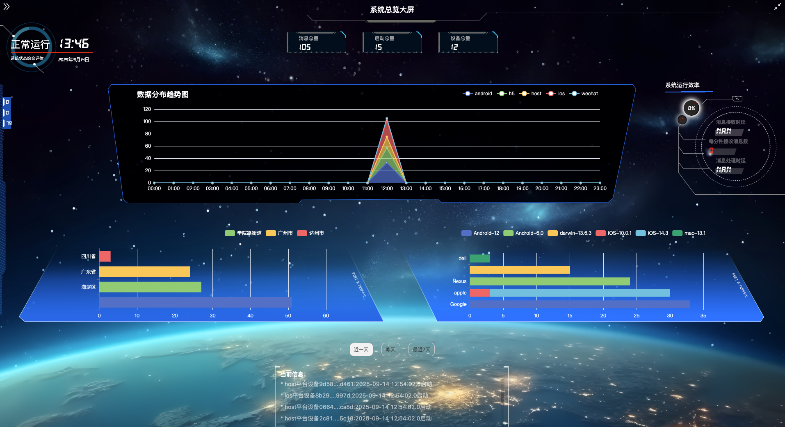
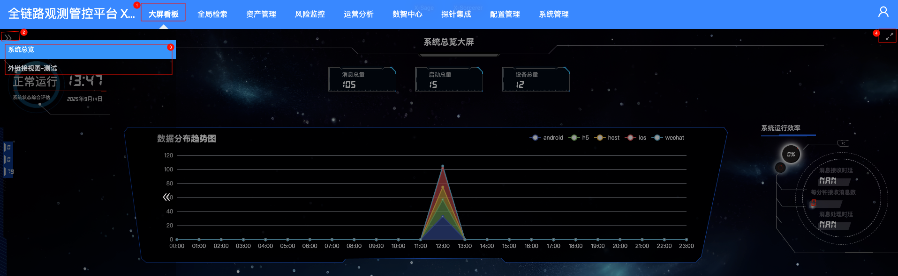
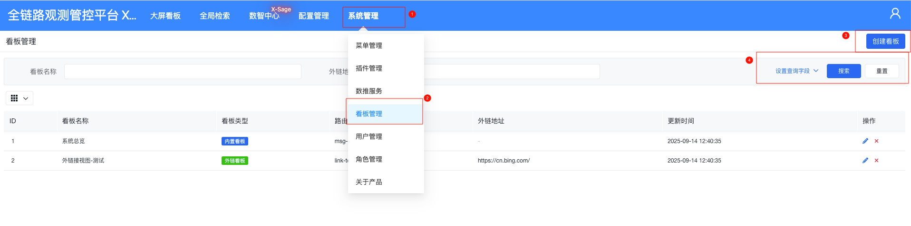
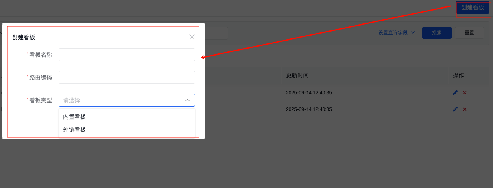

# 大屏看板

> 大屏看板将核心业务指标以**全屏可视化**方式实时呈现，适用于指挥室、展厅、办公室电视墙等场景。  
> - 支持 16:9、4:3、21:9 等主流分辨率，自适应 1080P / 2K / 4K  
> - 自动轮播、自动刷新、离线缓存  
> - 支持嵌入外部BI工具页面

# 看板应用
这个大屏看板集成了多种功能，旨在为用户提供一个全面的系统监控和数据分析平台，帮助用户高效地管理和优化系统性能。  
支持全屏操作，默认提供一个系统状态看板，效果如下图所示：  

**系统信息概**
- 提供系统消息总量、启动总量和设备总量的概览，帮助用户了解系统的规模和活动水平。

**系统状态监控**
- 实时显示系统的运行状态，包括当前时间、系统启动时间等基本信息。
- 提供系统运行效率的概览，包括消息接收和处理的时延等关键性能指标。

**数据分布趋势图**
- 展示不同数据源（如Android、iOS、Host等）在一天中不同时间段的分布趋势。
- 通过图表形式直观地呈现数据的变化情况，帮助用户快速识别高峰时段。

**地区和设备分布**
- 提供数据在不同地区的分布情况，如四川省、广东省、海淀区等。
- 展示不同设备类型（如Dell、Nexus、Apple、Google等）的数据分布，帮助用户了解数据的来源和分布情况。

**时间筛选功能**
- 允许用户选择查看近一天、昨天或最近7天的数据，方便用户根据不同时间范围进行数据分析。

**消息记录**
- 显示最近的系统消息记录，包括设备ID和启动时间，帮助用户追踪系统活动和事件。

**选择其他看板**  
根据需求可以选择已经添加的看板，选择操作如下所示：  

*其他看板需要自定义添加，具体添加方式参考文档*

# 看板管理 
通过系统管理->看板管理可以打开当前用户已添加的看板列表，并添加新的看板。  
看板列表页面如下图所示：  

添加看板操作如下图所示：  

