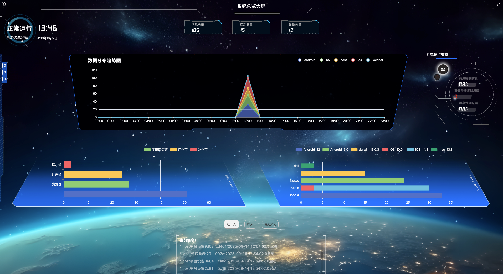
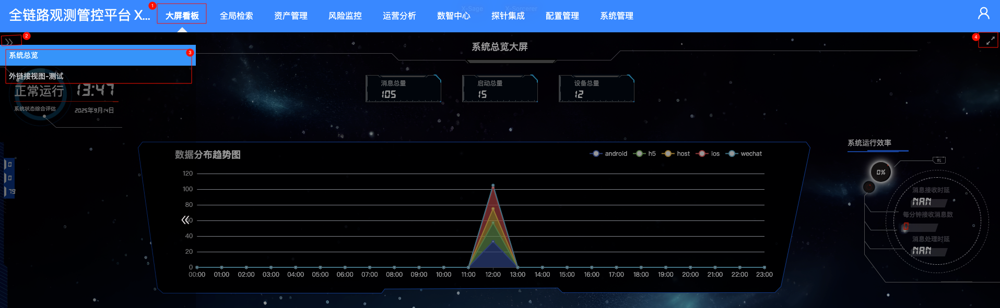
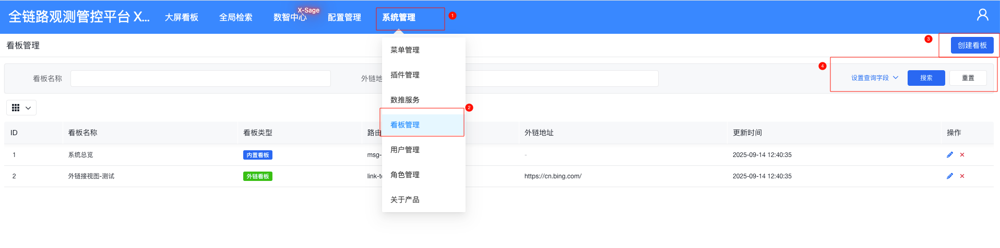
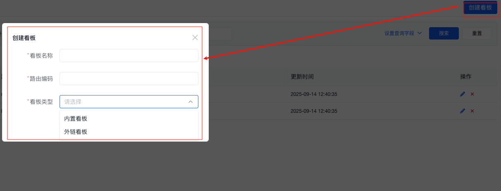

# 大屏看板

> 大屏看板将核心业务指标以**全屏可视化**方式实时呈现，适用于指挥室、展厅、办公室电视墙等场景。  
> - 支持 16:9、4:3、21:9 等主流分辨率，自适应 1080P / 2K / 4K  
> - 自动轮播、自动刷新、离线缓存  
> - 支持嵌入外部BI工具页面

# 看板应用
这个大屏看板集成了多种功能，旨在为用户提供一个全面的系统监控和数据分析平台，帮助用户高效地管理和优化系统性能。  
支持全屏操作，默认提供一个系统状态看板，效果如下图所示：  

**平台内容概览**
- 提供实体类型、数据推送任务、AI分析任务和业务应用服务数量，帮助用户了解平台当前承载的主要内容。

**系统状态监控**
- 实时显示系统综合状态、当前时间、业务服务健康度、异常实例和近24小时业务服务事件。
- 数据推送服务不可用时以 `--` 展示任务数，并明确提示数据源异常，避免误报为零。

**实体上报趋势**
- 展示各实体基于平台内置创建时间统计的数据上报曲线，以及业务应用服务实例的实时有效状态分布。
- 今天和昨天按小时展示，最近7天按自然日展示；未配置趋势时间属性的实体不影响其他实体统计。

**AI分析任务状态**
- 展示各任务状态的数量分布，并滚动显示最近更新的10个AI分析任务。

**时间筛选功能**
- 允许用户选择查看近一天、昨天或最近7天的数据，方便用户根据不同时间范围进行数据分析。

**自动刷新**
- 系统概览每30秒刷新；今天和最近7天的实体统计每60秒刷新；昨天数据仅在切换时查询。

**选择其他看板**  
根据需求可以选择已经添加的看板，选择操作如下所示：  

*其他看板需要自定义添加，具体添加方式参考文档*

# 看板管理 
通过系统管理->看板管理可以打开当前用户已添加的看板列表，并添加新的看板。  
看板列表页面如下图所示：  

添加看板操作如下图所示：  

## 看板类型与路由编码

看板管理支持四种类型，不同类型的必填字段不同：

| 类型 | 用途 | 必填配置 |
| :--- | :--- | :--- |
| 内置看板 `BUILT` | 前端已有固定组件的大屏页面 | 名称、类型、路由编码 `code` |
| 低代码页面看板 `LOW_CODE_PAGE` | 通过 AMIS 配置渲染页面 | 名称、类型、配置索引 `configIndex` |
| HTML 页面看板 `HTML_PAGE` | 展示静态 HTML 页面 | 名称、类型、HTML 路径 `htmlPath` |
| 外链看板 `LINK` | 嵌入外部系统或 BI 页面 | 名称、类型、URL `url` |

“路由编码”只对内置看板必填。内置看板需要通过该编码找到前端内置组件，例如当前系统状态总览看板使用 `system-board`。前端仍兼容旧编码 `msg-board`，后端启动时会将旧的默认看板记录迁移为新编码。如果内置看板编码没有匹配到前端组件，页面会展示“内置看板不存在或未配置”的空状态。

低代码页面看板、HTML 页面看板、外链看板不需要填写路由编码，系统会优先使用看板 ID 进行选中、高亮和打开，避免多个非内置看板因为编码为空或重复导致定位错误。

## 默认看板

系统始终保留一个默认看板。通过看板管理创建或编辑其他看板时，可以打开“默认看板”开关，原默认项会自动取消。当前默认看板不能直接关闭开关或删除，需要先将其他看板设为默认。

普通进入大屏看板页面时会显示默认看板；通过 `id`、`code` 或 `name` 参数打开指定看板时，指定项优先于默认项。

HTML 页面看板的 `htmlPath` 只填写相对于静态页面目录的文件路径，例如 `reports/security-overview.html`。系统会从 `/zenvis/html-page/reports/security-overview.html` 加载页面，不要填写 `/html-page/`、`/zenvis/html-page/` 或完整 URL 前缀。

## 看板抽屉交互

大屏看板左侧抽屉使用 Element Drawer 实现。用户点击左侧按钮后，抽屉从按钮位置展开；点击抽屉外区域时自动收回。该交互只调整抽出位置，不改变原有抽屉内容和视觉样式。
