# 数智中心

> 数智中心是依托AI大模型技术，融合检测分析业务知识经过优化训练后实现自动化值守的系统。  
> 该系统利用先进的人工智能技术和机器学习算法，对平台采集的海量数据进行深度分析和智能处理，为用户提供全方位的智能化服务。

## 核心价值

- **智能化服务**：基于AI大模型实现自然语言交互，降低用户使用门槛
- **自动化处理**：从数据查询到风险处置全流程自动化，减少人工干预
- **决策支持**：通过数据分析和模型预测，为业务决策提供科学依据
- **效率提升**：自动化生成报表、插件等，大幅提升工作效率

## 技术优势

- **AI大模型驱动**：采用先进的大语言模型技术，具备强大的理解和生成能力
- **业务知识融合**：深度融合检测分析业务知识，提供专业级智能服务
- **全流程覆盖**：涵盖数据查询、分析、策略制定、执行验证等完整流程
- **持续学习优化**：系统具备自我学习和优化能力，不断提升服务质量

## 适用场景

- **智能运维**：自动处理日常运维任务，降低人力成本
- **风险识别**：智能识别潜在风险并提供处置建议
- **运营分析**：自动生成运营分析报告，辅助管理决策
- **知识管理**：基于知识库提供智能问答服务

# 知识问答

以当前系统导入的知识库为基础，通过自然语言交互模式回答用户问题。系统能够理解用户意图，从海量知识数据中快速检索相关信息，并以易于理解的方式呈现给用户。

## 核心能力

- **自然语言理解**：支持多种问法和表达方式，准确理解用户需求
- **知识检索**：基于语义检索技术，快速定位相关知识点
- **智能回答**：将检索到的信息组织成易于理解的答案
- **上下文关联**：支持多轮对话，保持上下文连贯性

## 应用场景

- 系统使用咨询
- 技术问题解答
- 业务流程查询
- 配置参数说明

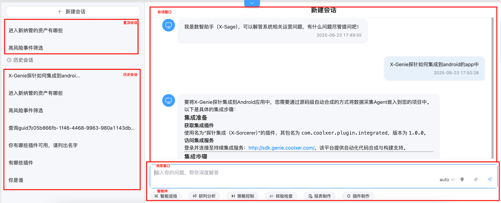
*图1：知识问答功能界面，用户可通过自然语言与系统交互，获取相关业务知识和系统使用帮助*

# 智能巡检

智能巡检主要用于数据智能查询，通过智能问答方式实现数据查询、可视化展示、下钻查询等。用户可以通过自然语言描述需要查询的数据内容，系统自动解析并执行相应的数据查询操作。

## 核心功能

- **智能查询**：通过自然语言描述查询需求，自动转换为结构化查询语句
- **可视化展示**：将查询结果以图表、表格等形式直观展示
- **下钻分析**：支持逐层深入分析，挖掘数据背后的原因
- **异常检测**：自动识别数据中的异常点并进行标记

## 使用优势

- **操作简便**：无需掌握复杂的查询语法，通过自然语言即可完成查询
- **实时响应**：秒级响应查询请求，提高工作效率
- **多维分析**：支持多维度数据分析，满足不同业务场景需求
- **灵活展示**：支持多种图表类型，满足不同数据展示需求

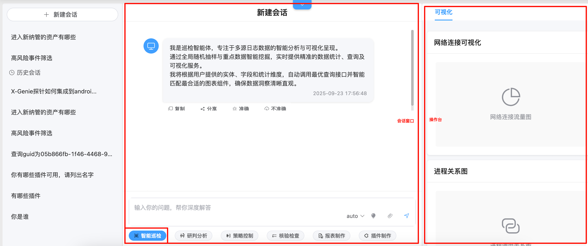
*图2：智能巡检功能界面，支持通过自然语言进行数据查询和可视化展示*

# 研判分析

根据单条告警事件，自动关联相关事件以及调用外部工具实现对告警事件的联合分析，并且根据分析结果给出风险评估结果。系统能够从多个维度对告警事件进行深度分析，提高风险识别的准确率。

## 分析流程

1. **事件接收**：接收来自各监测模块的告警事件
2. **关联分析**：自动关联历史事件、相关资产、类似告警等信息
3. **外部工具调用**：根据需要调用第三方分析工具进行深度分析
4. **风险评估**：综合分析结果，给出风险等级和处置建议

## 核心能力

- **多源数据融合**：整合来自不同数据源的信息进行综合分析
- **智能关联**：自动发现事件间的潜在关联关系
- **外部集成**：支持与第三方安全工具集成，扩展分析能力
- **风险量化**：将分析结果转化为可量化的风险评估指标

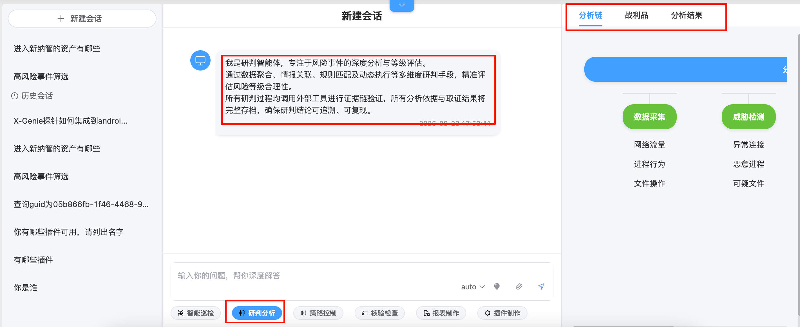
*图3：研判分析功能主界面，展示告警事件的详细信息和分析入口*

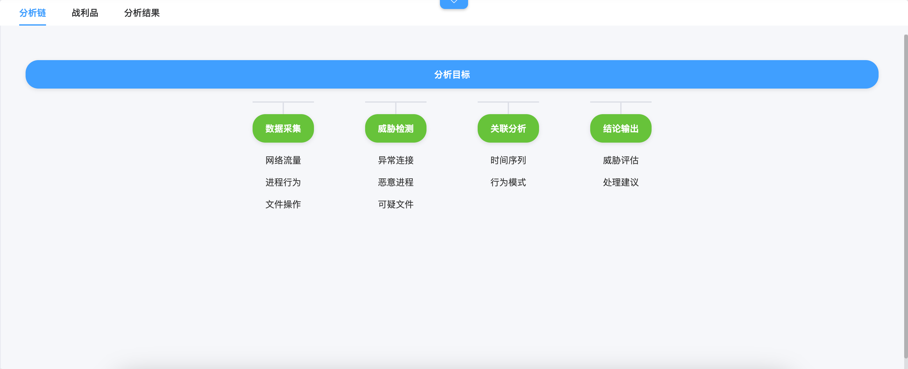
*图4：分析链视图，展示告警事件的关联分析过程和涉及的各类数据源*

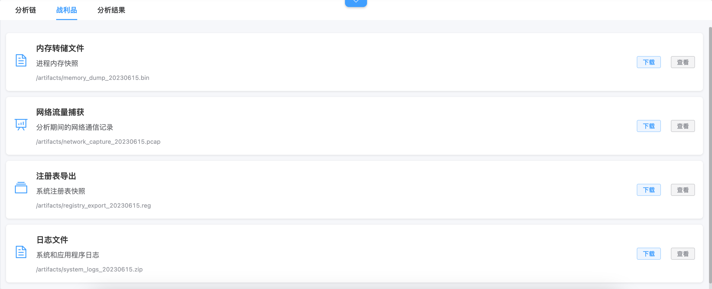
*图5：战利品界面，展示分析过程中提取的关键信息和证据*

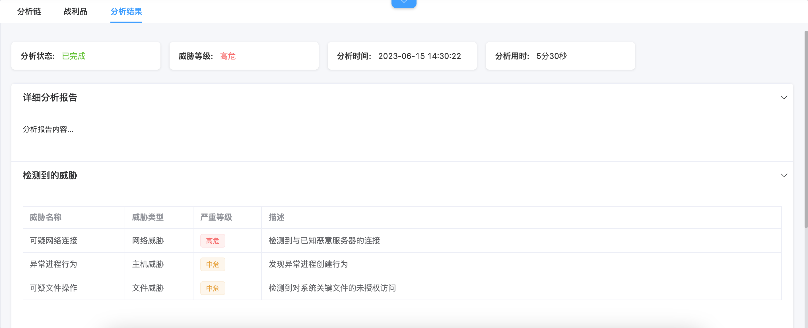
*图6：分析结果展示界面，包含风险评估等级和详细分析结论*

# 策略控制

经过研判分析后的事件需要进行不同的处理。通过智能问答方式实现采集策略、标记策略、响应控制、告警、持续分析等策略的自动化建议和生成，经人工核验确认后可以应用生效。

## 策略类型

- **采集策略**：调整数据采集的频率、范围和深度
- **标记策略**：定义数据标记规则和分类标准
- **响应控制**：制定针对不同类型事件的响应措施
- **告警策略**：设置告警阈值和通知方式
- **分析策略**：优化数据分析模型和算法

## 工作流程

1. **策略建议**：基于分析结果自动生成策略建议
2. **人工核验**：专家对建议策略进行审核和调整
3. **策略部署**：将确认的策略部署到相应模块
4. **效果评估**：持续监控策略执行效果并进行优化

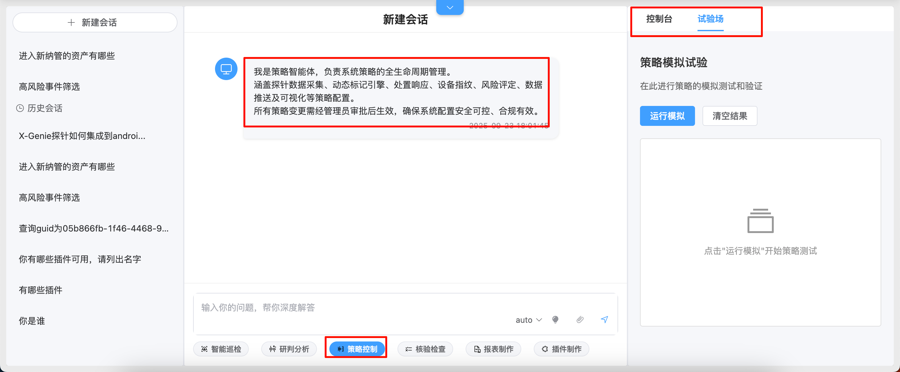
*图7：策略控制功能主界面，集中管理各类处理策略*

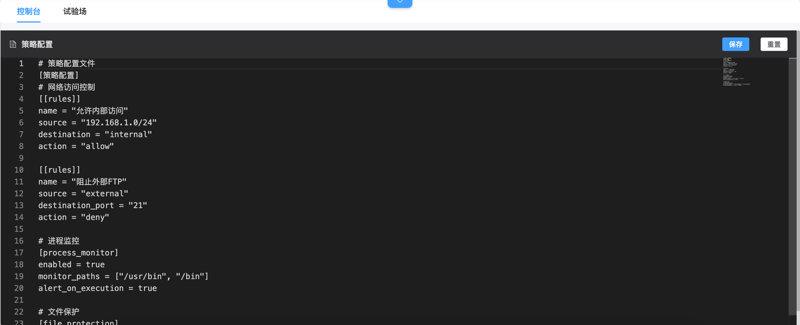
*图8：策略控制台界面，提供策略配置和管理操作面板*

*图9：策略试验场界面，用于测试和验证策略效果*

# 核验检查

研判分析的结果认定需要处置，并且配置了处置策略，需要对处置结果进行持续核验，以确保风险得到妥善处理。系统会自动跟踪处置措施的执行情况，并验证处置效果。

## 核验内容

- **处置执行情况**：检查处置措施是否按计划执行
- **效果评估**：评估处置措施的实际效果
- **风险闭环**：确认风险是否已完全消除
- **持续监控**：对已处置风险进行持续跟踪

## 核验机制

- **自动化核验**：通过预设规则自动验证处置效果
- **人工复核**：重要风险需人工确认处置结果
- **定期检查**：对长期风险进行定期复查
- **报告生成**：自动生成核验报告供管理层审阅

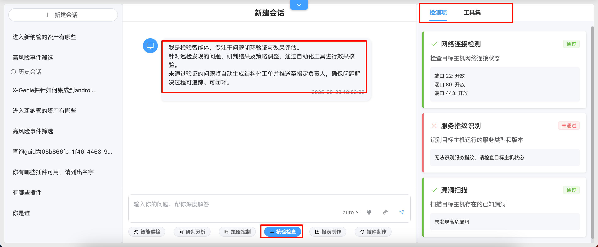
*图10：核验检查功能主界面，展示待核验的风险事件和处置状态*

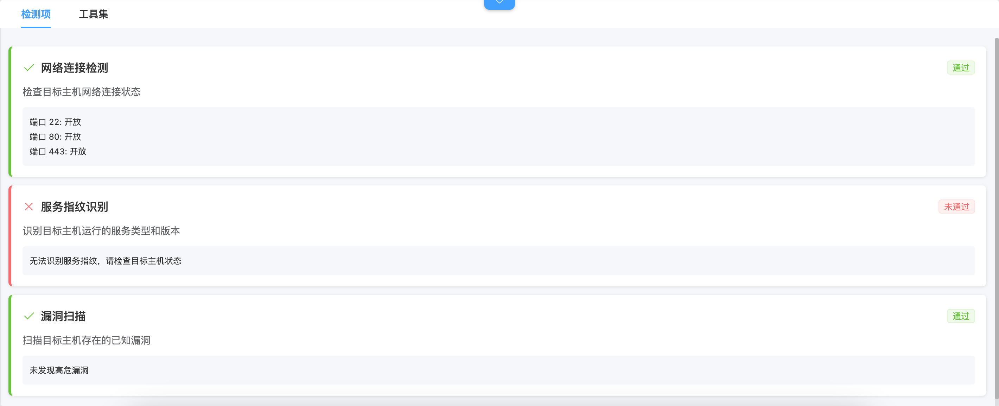
*图11：检测项配置界面，定义核验的具体检查项目和标准*

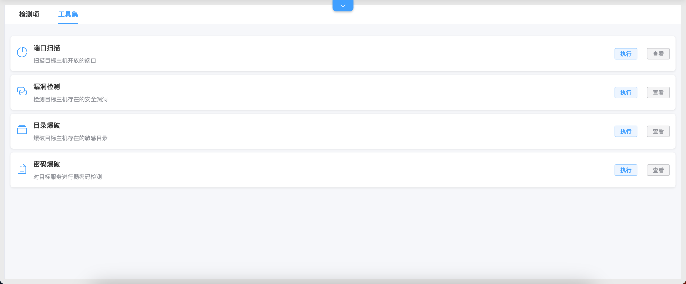
*图12：核验工具集界面，提供各类自动化核验工具*

# 报表制作

经过智能巡检、研判分析、策略控制、核验检查等一系列操作后实现了对风险事件的全流程处理，每个阶段的产物都可作为分析素材用于生成报表。通过内置模板以及根据自己的诉求创建新的模板，快速生成报表。

## 报表类型

- **运营日报**：日常运营情况汇总
- **风险周报**：风险事件统计和分析
- **分析月报**：深度分析报告和趋势预测
- **专项报告**：针对特定问题的详细分析报告

## 核心功能

- **模板管理**：提供丰富的报表模板库
- **自定义设计**：支持用户创建个性化报表模板
- **数据自动填充**：根据模板自动填充相关数据
- **多格式导出**：支持PDF、Excel、Word等多种格式导出

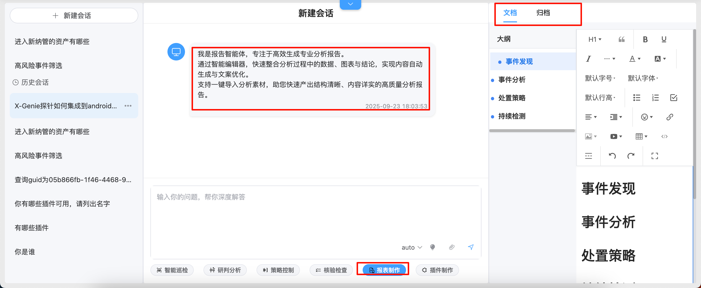
*图13：报表制作功能主界面，提供报表模板选择和制作入口*

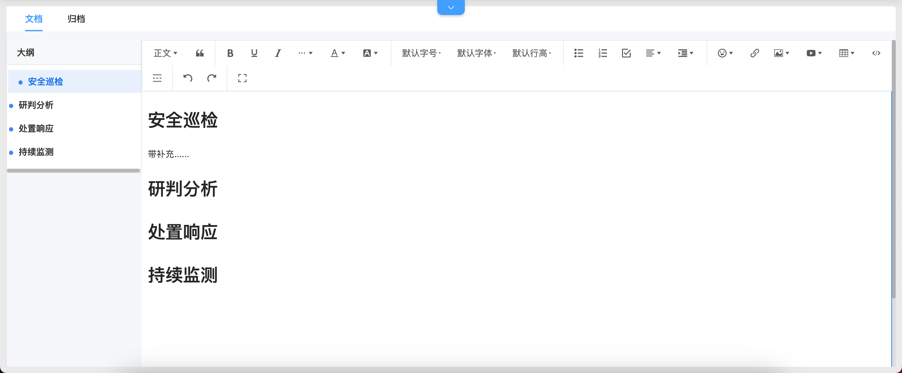
*图14：报表文档界面，展示已生成的各类分析报表*

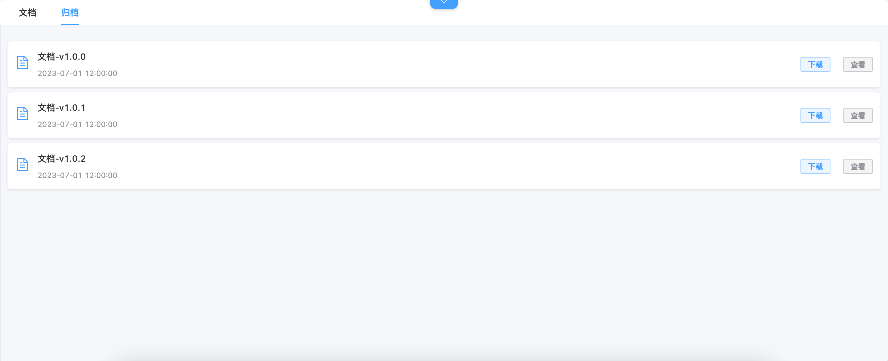
*图15：报表归档界面，管理历史报表和归档记录*

# 插件制作

常规插件开发需要通过手工制作，依赖的基础知识比较多，当前基于数智中心进行开发，已经将插件制作相关知识库导入，用户只需要提出需求便可以通过智能问答的方式实现插件制作，整个插件的制作产物可视化支持二次编辑，大大提高了插件的制作效率。

## 制作流程

1. **需求描述**：用户通过自然语言描述插件需求
2. **智能解析**：系统自动解析需求并生成插件框架
3. **可视化配置**：通过可视化界面配置插件参数和功能
4. **二次编辑**：支持对生成的插件进行手动调整和优化
5. **测试部署**：完成插件测试并部署到生产环境

## 技术特点

- **零代码开发**：无需编程基础即可制作插件
- **智能推荐**：根据需求自动推荐合适的插件模板
- **可视化操作**：通过拖拽方式完成插件配置
- **快速部署**：一键部署，快速投入使用

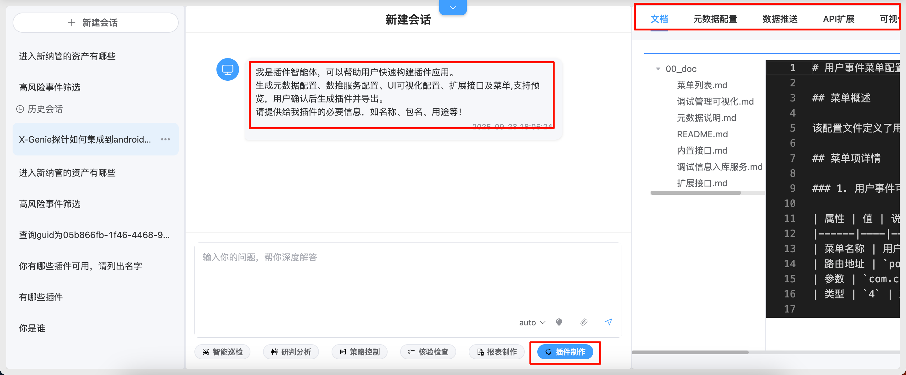
*图16：插件制作功能主界面，提供插件需求描述和制作入口*

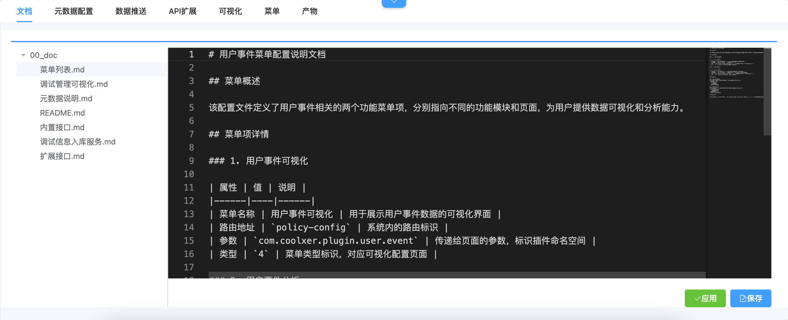
*图17：插件文档界面，展示插件相关信息和使用说明*

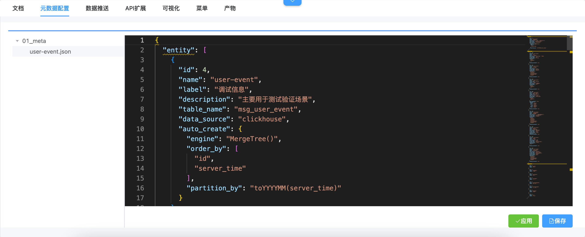
*图18：插件元数据配置界面，定义插件的基本信息和属性*

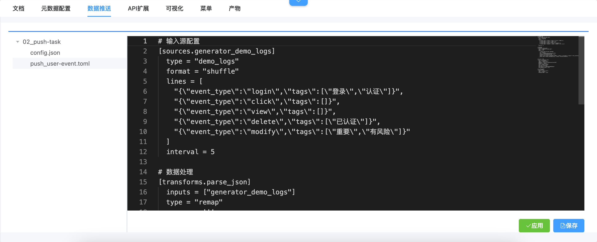
*图19：插件数据推送配置界面，设置插件的数据传输规则*

*图20：插件API扩展界面，配置插件的外部接口*

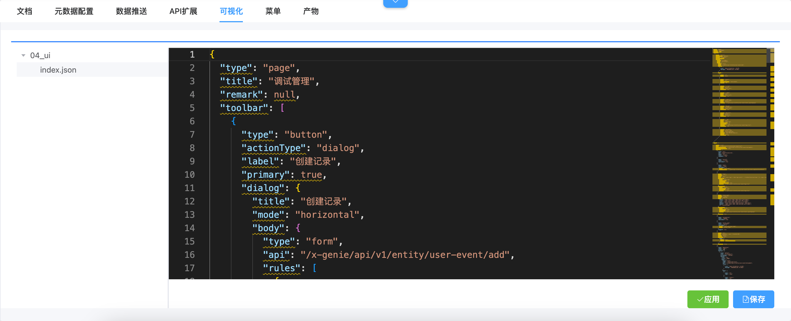
*图21：插件可视化配置界面，通过拖拽方式配置插件功能*

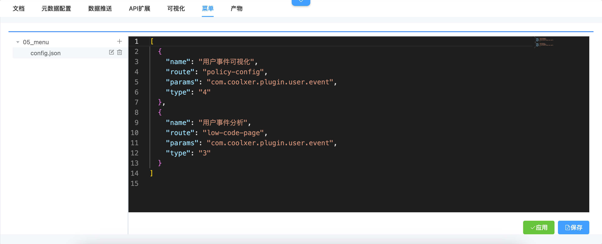
*图22：插件菜单配置界面，定义插件在系统中的菜单入口*

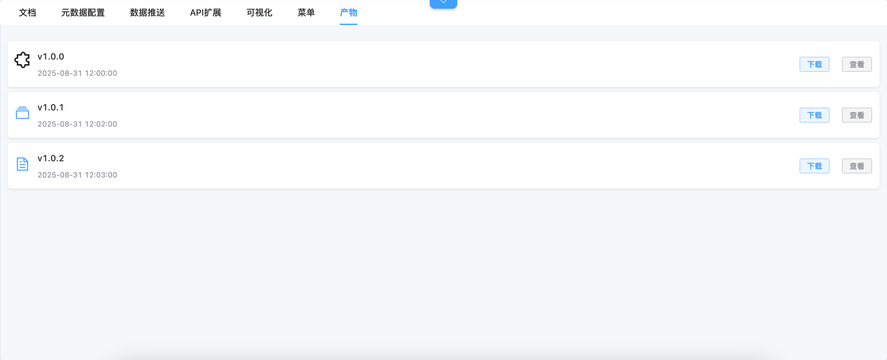
*图23：插件制作产物界面，展示生成的插件文件和配置*

# 智能值守

将智能巡检、研判分析、策略控制、核验检查、报表制作、插件制作进行集成，实现全程无人智能值守。系统能够7×24小时不间断工作，自动处理各类任务，确保业务连续性和安全性。

## 值守能力

- **全天候监控**：7×24小时不间断监控系统状态
- **自动处理**：自动执行预定义的处理流程
- **异常预警**：发现异常情况及时发出预警
- **自适应优化**：根据运行情况自动优化处理策略

## 应用价值

- **降本增效**：大幅减少人工投入，提高工作效率
- **提升质量**：标准化处理流程，减少人为错误
- **快速响应**：秒级响应各类事件，缩短处理时间
- **持续优化**：通过机器学习不断优化处理效果

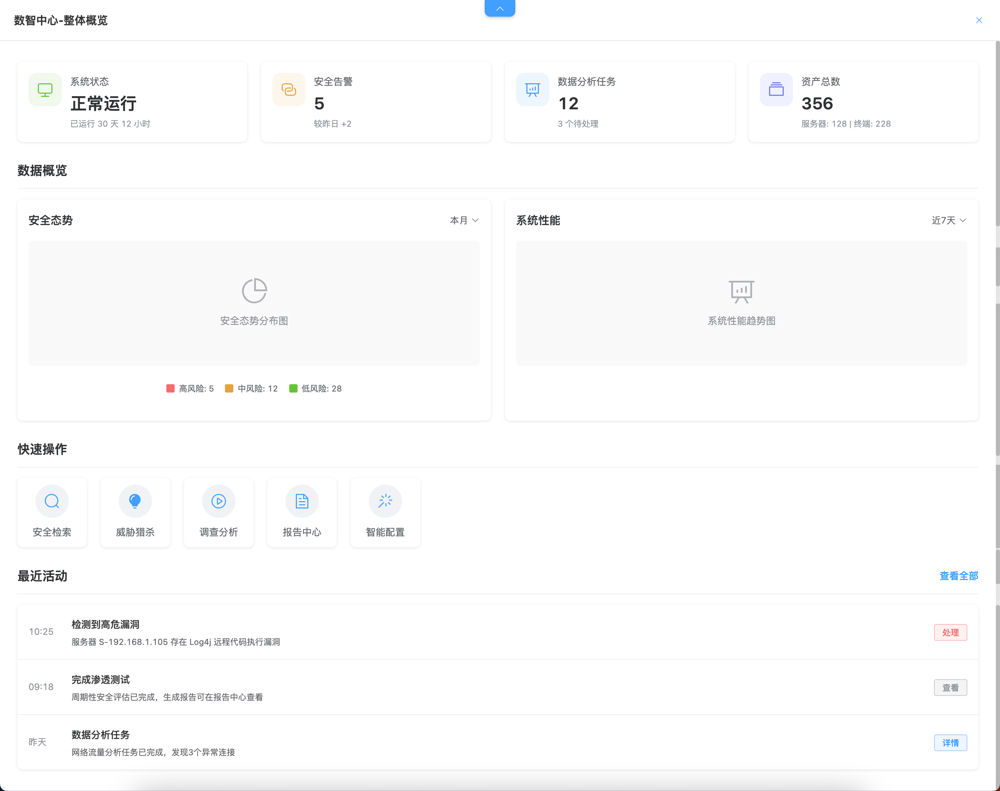
*图24：智能值守功能全景图，展示系统7×24小时自动化值守能力*