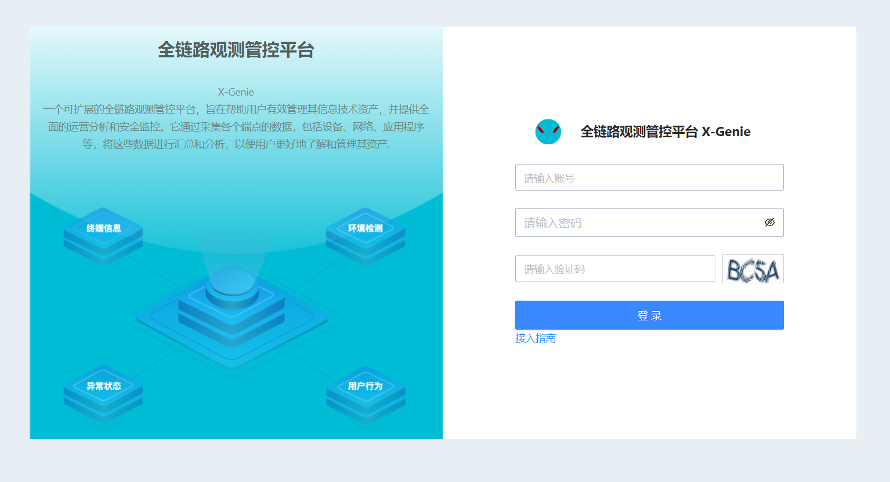
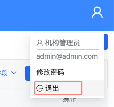
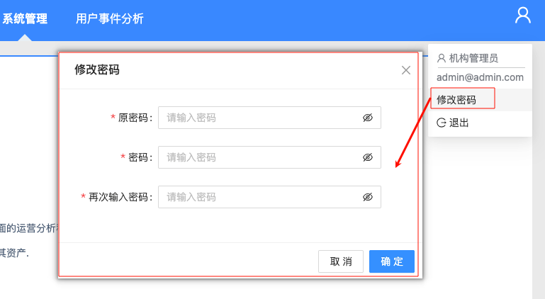

# 登录认证

> - 默认提供账号密码登录  
> - 支持定制单点登录（SSO：SAML 2.0 / OIDC）  
> - 支持定制多因素认证（MFA：TOTP、短信、企业微信扫码）  
---

# 账号密码登录 
> 账号由管理员创建和分配，不支持自主注册创建

打开浏览器访问：`http://<域名/IP>:<PORT>`  
输入**账号\密码**登录，页面如下：   

登录成功进入主页。  
首次安装在没有安装插件的情况下，默认只包含五个功能项：
- 大屏看板：提供大屏展示能力
- 全局检索：搜索系统所有注册的实体数据
- 数智中心：基于AI的智能分析模块
- 配置管理：提供全局配置的管理
- 系统管理：提供系统管理功能

页面如下图所示：  

通过安装插件可以增加扩展功能项，插件目前支持：
- 资产管理：收集设备信息，提供资产管理功能
- 运营分析：收集行为数据，提供运营分析功能
- 风险监控：收集状态数据，提供风险监控功能
- 探针管理：提供探针管理功能   
- 探针集成：提示提供探针集成功能

插件安装使用说明参考：[系统管理-插件管理](功能说明-系统管理?id=插件管理)  
安装插件之后页面示例如下图：

# 账号密码登出 

用户操作完毕后，可在右上角用户管理中退出。  
操作页面如下：  

---

# 账号密码修改

在右上角用户管理中，选择修改密码，原密码认证通过后，可修改当前登录账号的密码。  
密码策略要求需要符合标准：  

| 密码策略项 | 默认值 | 可配置范围 |
|---|---|---|
| 密码最小长度 | 8 | 6–32 |
| 必须包含特殊字符 | 是 | 是/否 |
| 密码过期时间 | 90 天 | 0（永不过期）–365 天 |
| 会话超时时间 | 15 min | 5 min–8 h |
| 同账号最大会话数 | 3 | 1–10 |

操作页面如下图所示：  

> 修改保存后立即生效，不影响已有会话