# 系统管理

> 系统管理模块是平台的后台管理核心，主要用于帮助系统管理员进行全方位的系统配置和用户管理。  
> 通过该模块，管理员可以维护系统的菜单结构、插件扩展、数据推送服务、看板展示、用户权限等关键功能。  

**系统管理包含以下核心功能模块：**

1. **菜单管理**
   - 负责管理系统的菜单项，包括添加、编辑、删除菜单项，以及设置菜单的显示顺序和层级结构。

2. **插件管理**
   - 用于管理系统中的插件，包括插件的安装、更新、卸载和配置。插件可以扩展系统的功能。

3. **数推服务**
   - 提供数据分析和推送服务，包括数据挖掘、分析报告生成以及将分析结果推送给用户。

4. **看板管理**
   - 管理数据看板，允许用户创建、编辑和删除看板，以及配置看板的布局和显示内容。

5. **用户管理**
   - 管理系统的用户账户，包括用户的创建、编辑、删除、权限分配和用户信息的维护。

6. **角色管理**
   - 管理用户角色和权限，定义不同角色的权限范围，以及将用户分配到相应的角色。

7. **关于产品**
   - 提供产品的相关信息，如产品介绍、版本信息、版权声明、联系方式等，帮助用户了解产品。

系统主界面如下图所示：

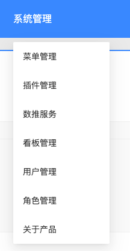

# 菜单管理

菜单管理功能允许管理员自定义系统的导航菜单结构，包括创建、修改、删除菜单项以及调整菜单的显示顺序和层级关系。

## 主要功能

- **菜单列表查看**：展示系统中所有菜单项的列表，支持分页和搜索
- **菜单项添加**：创建新的菜单项，设置菜单名称、图标、链接等属性
- **菜单项编辑**：修改现有菜单项的属性信息
- **菜单项删除**：移除不再需要的菜单项（需确认操作）
- **顺序调整**：通过拖拽方式调整菜单项的显示顺序
- **层级管理**：设置菜单项的父子关系，构建多级菜单结构

## 操作界面

**菜单列表管理页面：**
展示所有菜单项的列表视图，支持搜索和筛选功能。
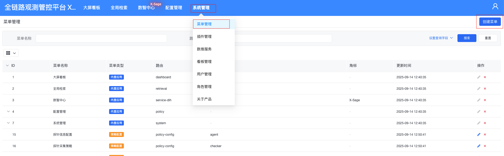

**菜单编辑和删除页面：**
提供菜单项的编辑和删除操作界面，确保操作安全。
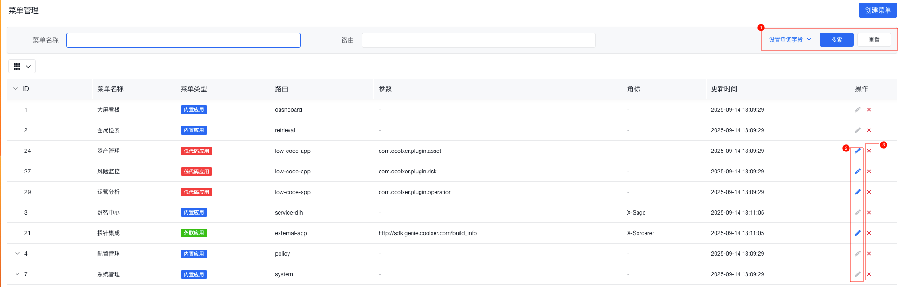

**添加菜单页面：**
用于创建新的菜单项，填写必要信息。
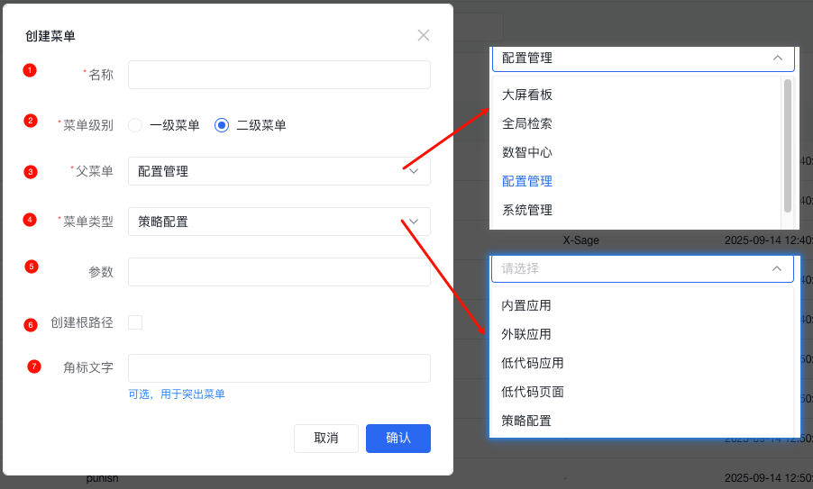

**菜单顺序调整页面1：**
通过可视化界面调整菜单项的显示顺序。
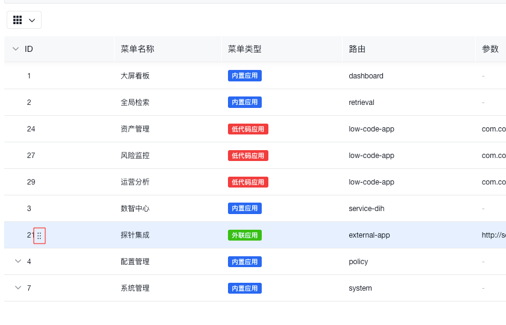

**菜单顺序调整页面2：**
支持拖拽操作调整菜单层级结构。
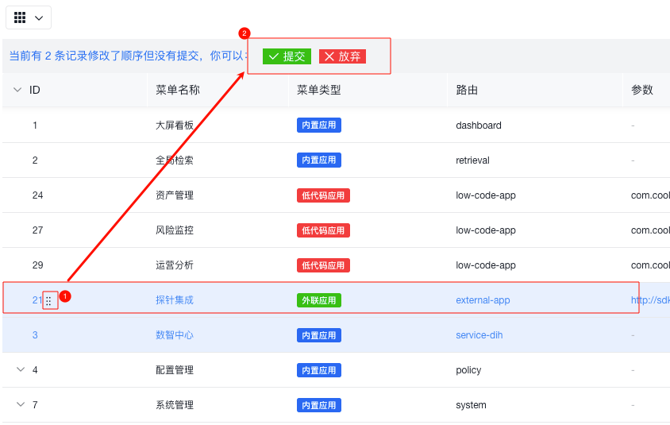

# 插件管理

插件管理功能允许管理员对系统插件进行全生命周期管理，包括插件的安装、更新、卸载和配置，以扩展系统功能。

## 主要功能

- **插件列表查看**：展示已安装和可安装的插件列表
- **插件上传**：支持上传新的插件包
- **插件安装**：将上传的插件安装到系统中
- **插件更新**：更新已安装插件到新版本
- **插件卸载**：从系统中移除插件
- **插件配置**：对插件进行参数配置
- **插件详情查看**：查看插件的详细信息和使用说明

## 操作界面

**插件列表管理页面：**
展示系统中所有插件的状态和基本信息。
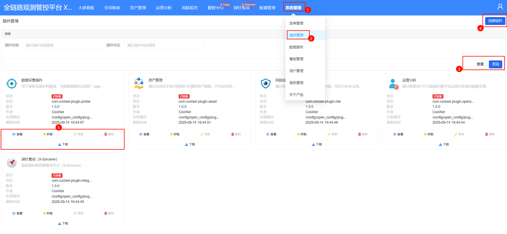

**添加插件页面：**
提供添加新插件的界面。
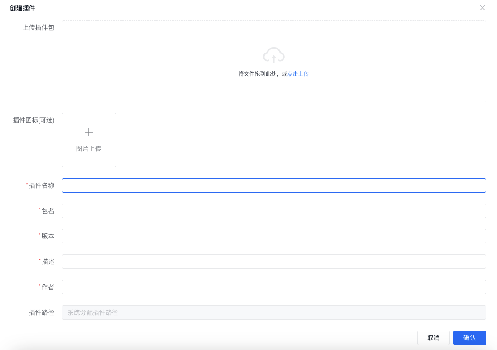

**上传插件页面：**
支持插件文件的上传操作。
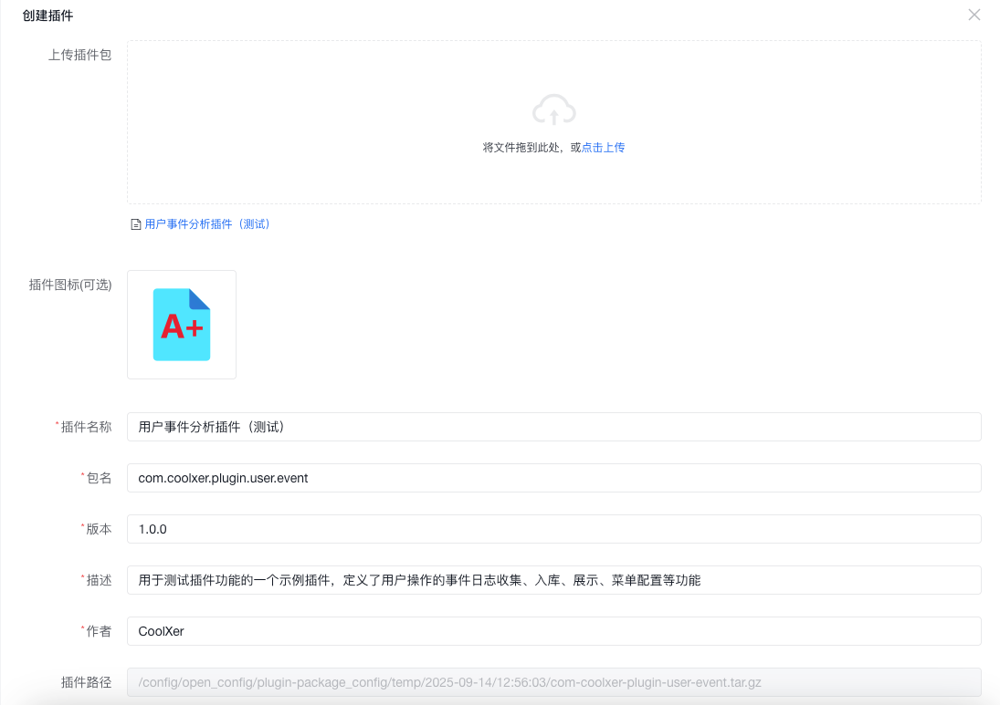

**插件查看页面：**
展示插件的详细信息。
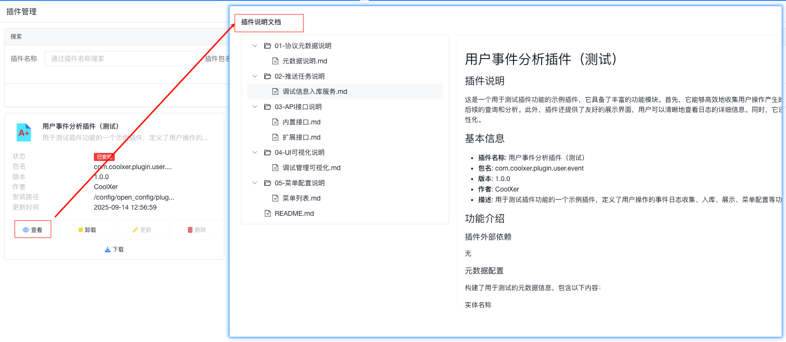

**插件更新页面：**
用于更新已安装的插件版本。
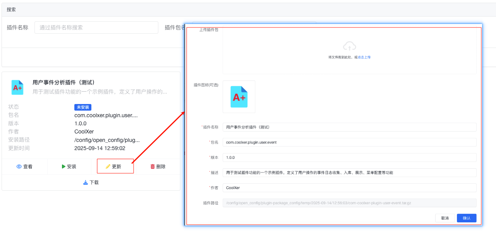

**插件删除页面：**
提供插件卸载功能，操作前需要确认。
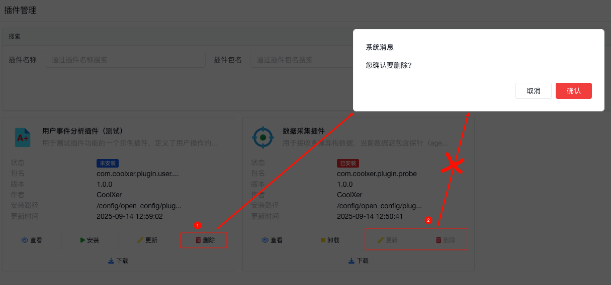

**插件安装页面：**
用于安装新上传的插件。
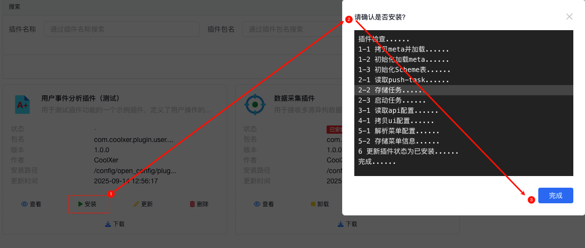

**插件卸载页面：**
用于卸载已安装的插件。
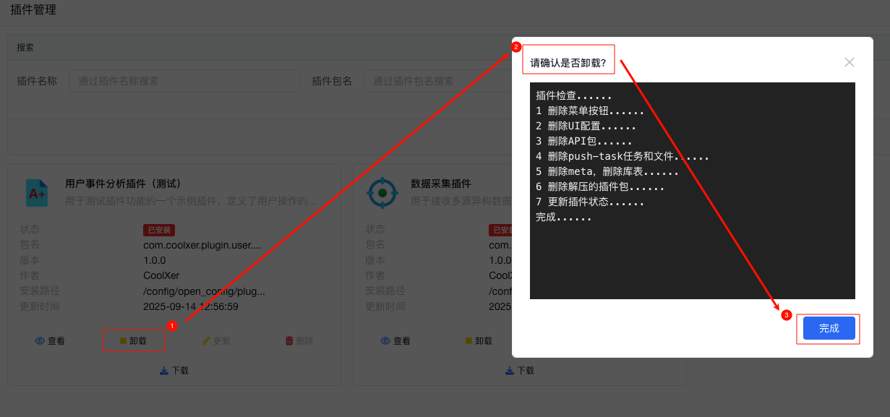

# 数推服务

数推服务提供数据分析和推送功能，支持创建和管理数据推送任务，定期生成分析报告并推送给指定用户。

## 主要功能

- **任务列表管理**：查看所有数据推送任务的状态和信息
- **任务创建**：创建新的数据推送任务
- **任务修改**：编辑现有任务的配置参数
- **任务日志查看**：查看任务执行日志和结果
- **任务调度管理**：设置任务的执行时间和频率

## 操作界面

**任务列表管理页面：**
展示所有数据推送任务的基本信息和状态。
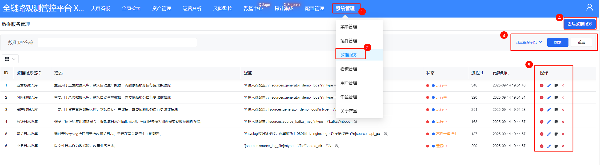

**添加任务页面：**
用于创建新的数据推送任务。
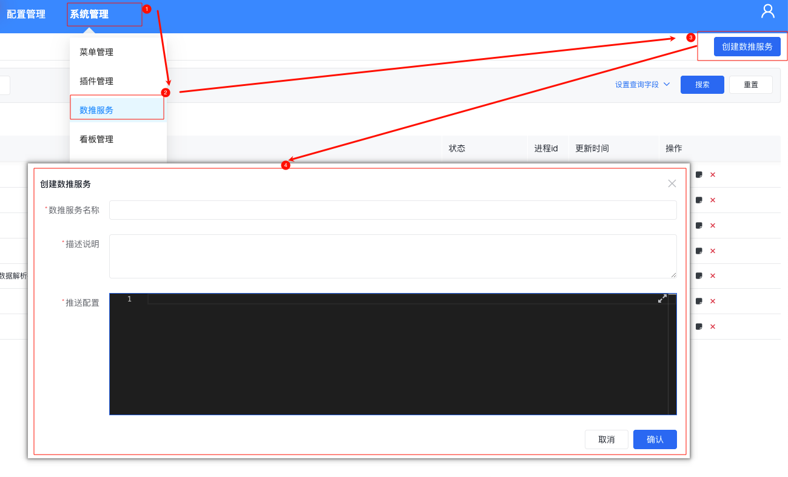

**修改任务页面：**
编辑现有任务的配置参数。
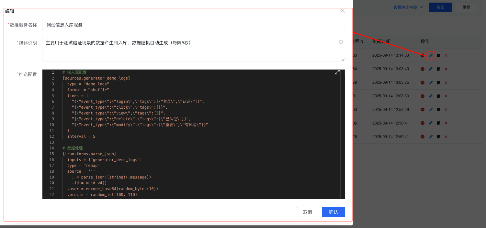

**任务日志查看页面：**
查看任务执行的详细日志信息。
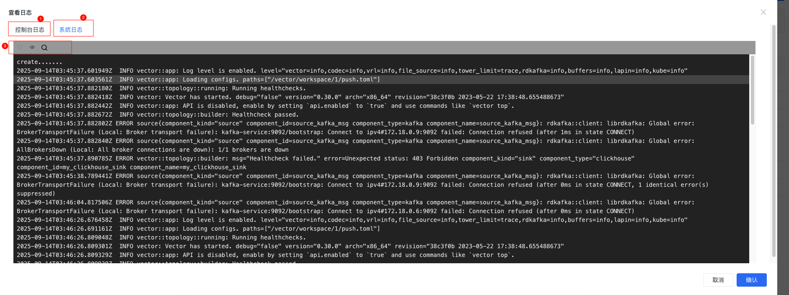

# 看板管理

看板管理功能允许用户创建和管理数据可视化看板，支持自定义布局和内容配置。

## 主要功能

- **看板列表管理**：查看所有已创建的看板
- **看板创建**：创建新的数据可视化看板
- **看板编辑**：修改看板的布局和内容
- **看板删除**：移除不再需要的看板

## 操作界面

**看板列表管理页面：**
展示所有已创建看板的列表。

**添加看板页面：**
用于创建新的数据可视化看板。

# 用户管理

用户管理功能用于管理系统中的用户账户，包括用户的创建、编辑、删除和权限分配。

## 主要功能

- **用户列表查看**：展示系统中所有用户的信息
- **用户创建**：添加新的用户账户
- **用户编辑**：修改用户信息和权限设置
- **用户删除**：移除用户账户
- **密码重置**：为用户重置登录密码
- **状态管理**：启用或禁用用户账户

## 操作界面

**用户列表管理页面：**
展示所有系统用户的基本信息。
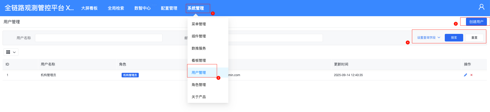

**添加用户页面：**
用于创建新的用户账户。
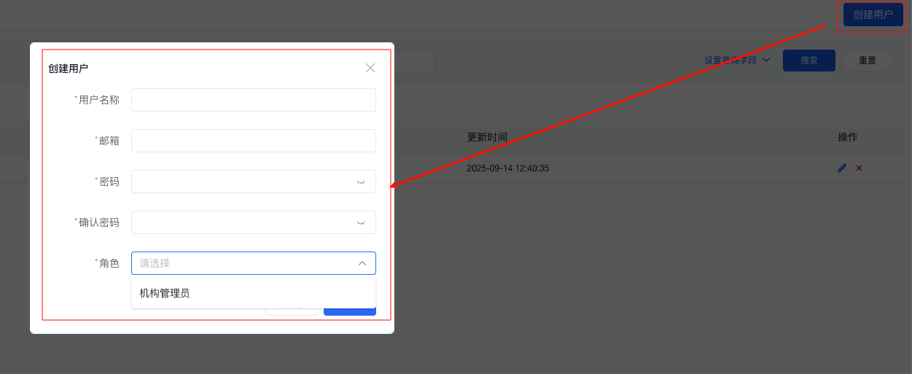

# 角色管理

角色管理功能用于定义和管理用户角色及其权限范围，实现基于角色的访问控制。

## 主要功能

- **角色列表查看**：展示系统中所有角色的信息
- **角色创建**：创建新的用户角色
- **角色编辑**：修改角色的权限配置
- **角色删除**：移除不再需要的角色
- **权限分配**：为角色分配相应的系统权限
- **用户分配**：将用户分配到对应的角色

## 操作界面

**角色列表管理页面：**
展示所有系统角色及其权限信息。
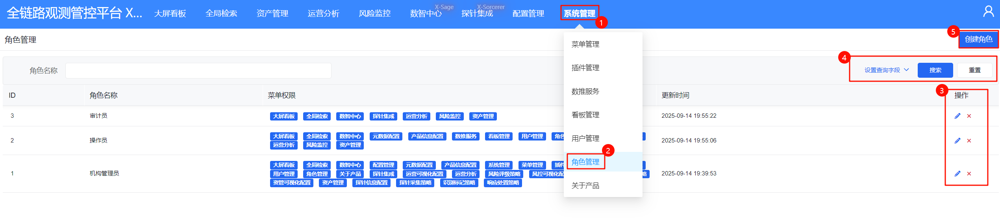

**添加角色页面：**
用于创建新的用户角色并配置权限。
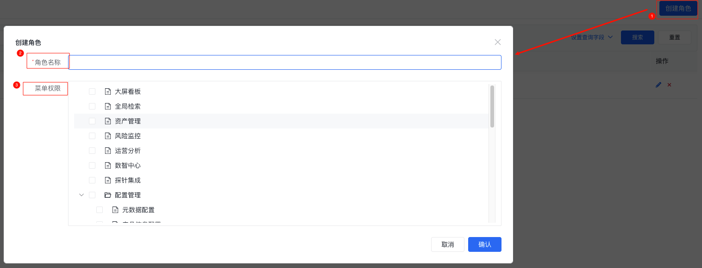

# 关于产品

关于产品页面提供产品的基本信息，包括版本号、版权声明、技术支持联系方式等。

## 主要信息

- 产品名称和版本信息
- 版权声明和法律信息
- 技术支持联系方式
- 系统运行状态信息

## 操作界面

**产品信息页面：**
展示产品的详细信息。
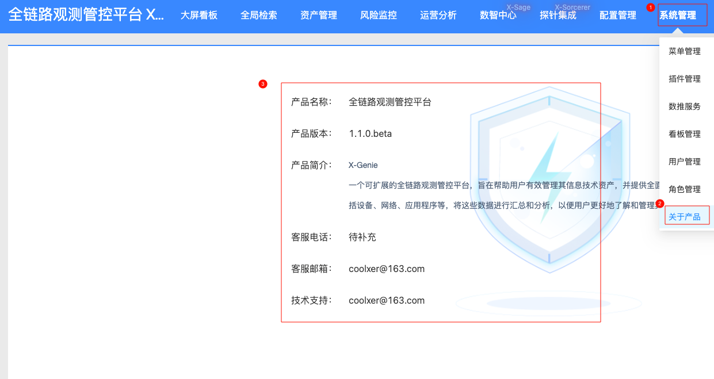