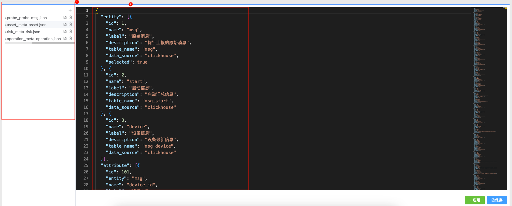
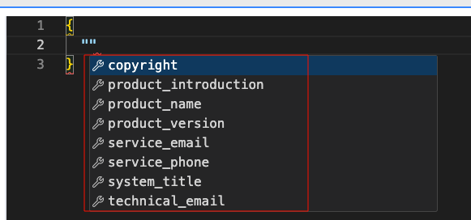
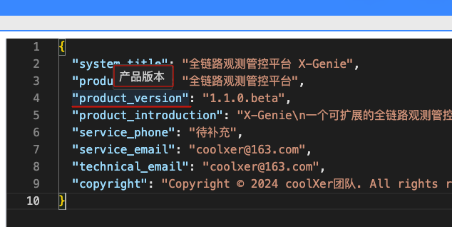
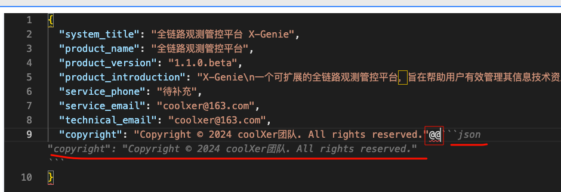

# 配置管理
> 配置管理功能提供了系统配置的入口，用户可以通过该功能对系统进行配置。  

**默认只包含两个配置项：**  
- 元数据配置
- 产品信息配置

通过扩展插件，用户可以扩展配置项，实现针对自定义配置的管理，支持如下：    
- 探针管理插件
  - 探针信息配置
  - 探针采集策略
  - 识别标记策略
  - 响应处置策略
- 资产梳理插件
  - 设备指纹策略
  - 资管可视化配置
- 运营分析插件
  - 运营可视化配置
- 风险管控插件  
  - 风险评级策略
  - 风险可视化配置

增加了插件后的配置管理页如下：  

# 配置面板说明
所有配置面板统一样式，左侧为配置文件列表区，右边为配置文件内容区。   
**保存：**修改的内容保存到配置文件，支持control+s快捷键保存。   
**应用：**将配置文件保存+生效到系统。    

# Schema格式校验和提示  
配置文件内容会通过Schema进行格式校验，如果格式有误，会提示错误信息。 
输入过程中会根据scheme提示用户快捷选择属性。 

鼠标放到属性字段上也会显示参数描述，方便操作人员理解。      

# AI补全
支持通过`@@`唤醒AI补全功能，AI补全功能会根据当前配置文件，自动提示当前配置项的属性。  

# 元数据配置 

### 主配置对象

| 字段名 | 类型 | 是否必填 | 描述 |
| --- | --- | --- | --- |
| entity | array | 是 | 实体配置数组 |
| attribute | array | 是 | 属性配置数组 |
| operator | array | 是 | 操作符配置数组 |

### 实体配置（entity）

| 字段名 | 类型 | 是否必填 | 描述 |
| --- | --- | --- | --- |
| id | integer | 是 | 实体ID |
| name | string | 是 | 实体名称 |
| label | string | 是 | 实体标签 |
| description | string | 是 | 实体描述 |
| table_name | string | 是 | 表名 |
| data_source | string | 是 | 数据源 |
| auto_create | object | 否 | 自动创建配置 |

#### 自动创建配置（auto_create）

| 字段名 | 类型 | 是否必填 | 描述 |
| --- | --- | --- | --- |
| engine | string | 是 | 数据库引擎 |
| order_by | array | 是 | 排序字段 |
| partition_by | string | 是 | 分区字段 |

### 属性配置（attribute）

| 字段名 | 类型 | 是否必填 | 描述 |
| --- | --- | --- | --- |
| id | integer | 是 | 属性ID |
| entity | string | 是 | 所属实体 |
| name | string | 是 | 属性名称 |
| label | string | 是 | 属性标签 |
| description | string | 是 | 属性描述 |
| column_name | string | 是 | 列名 |
| column_type | string | 是 | 列类型 |
| operators | array | 是 | 支持的操作符 |
| display_selected | boolean | 否 | 是否显示 |
| must_candidate | boolean | 否 | 是否必须候选（默认值：false） |
| mapping | object | 否 | 映射关系 |
| display_type | string | 否 | 显示类型（默认值：string） |
| search_type | string | 否 | 搜索类型（默认值：string） |

### 操作符配置（operator）

| 字段名 | 类型 | 是否必填 | 描述 |
| --- | --- | --- | --- |
| id | integer | 是 | 操作符ID |
| name | string | 是 | 操作符名称 |
| label | string | 是 | 操作符标签 |

# 产品信息配置 

| 字段名 | 类型 | 格式 | 是否必填 | 描述 |
| --- | --- | --- | --- | --- |
| system_title | string | - | 是 | 系统标题 |
| product_name | string | - | 是 | 产品名称 |
| product_version | string | - | 是 | 产品版本 |
| product_introduction | string | - | 是 | 产品介绍 |
| service_phone | string | - | 是 | 服务电话 |
| service_email | string | email | 是 | 服务邮箱 |
| technical_email | string | email | 是 | 技术邮箱 |
| copyright | string | - | 是 | 版权信息 |

### 说明
- **类型**：字段的数据类型。
- **格式**：字段的格式要求，如 `email` 表示必须符合电子邮件格式。
- **是否必填**：是否为必填字段。
- **描述**：字段的具体描述或用途。

# 更多配置
更多配置来源于插件，需要查看安装的插件中配置说明。  
- 探针管理插件
  - 探针信息配置
  - 探针采集策略
  - 识别标记策略
  - 响应处置策略
- 资产梳理插件
  - 设备指纹策略
  - 资管可视化配置
- 运营分析插件
  - 运营可视化配置
- 风险管控插件  
  - 风险评级策略
  - 风险可视化配置

