# 插件应用介绍

## 概述

插件应用是ZenVis平台提供的一种可扩展机制，允许用户根据特定业务需求定制和扩展系统功能。通过插件机制，用户可以在不修改核心系统代码的情况下，增加新的功能模块，实现业务场景的快速构建和部署。

## 技术优势

- **模块化设计**：插件以独立模块形式存在，便于开发、测试和维护
- **热插拔能力**：支持插件的动态安装和卸载，不影响系统正常运行
- **自动集成**：插件安装后自动与系统核心功能集成，包括菜单、权限、数据检索等
- **标准化接口**：提供统一的插件开发接口和规范，降低开发门槛

## 适用场景

- **业务定制**：根据不同行业或企业需求定制特定功能
- **功能扩展**：在基础平台之上增加新的业务模块
- **快速开发**：基于插件模板快速构建应用功能
- **独立部署**：将特定功能模块化，便于独立维护和升级

# 为什么需要插件应用

ZenVis系统定位为快速构建应用与业务监测的框架平台，提供数据采集、控制、收集、处理、展现等基础能力。   
针对上层业务的应用开发，需要用一种可扩展的方式，满足基于监测为基础的业务场景。  
插件应用就是ZenVis用来扩展系统功能的主要方式。

# 如何应用插件

首次部署ZenVis系统后，默认没有插件，需要按照自己需求添加插件后才能使用插件功能。

无插件时默认的菜单只包含：大屏看板、全局检索、数智中心、配置管理、系统管理五个菜单项，如下图所示：  
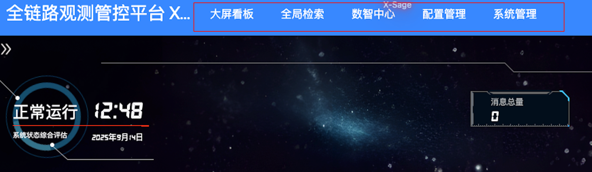  
*图1：系统初始状态下的菜单界面，仅包含基础功能模块*

无插件时全局检索默认没有数据实体，无法检索，如下图所示：
  
*图2：未安装插件时的全局检索界面，无业务数据可供检索*

通过添加插件功能，可以添加插件，并查看插件详情，如下图所示：
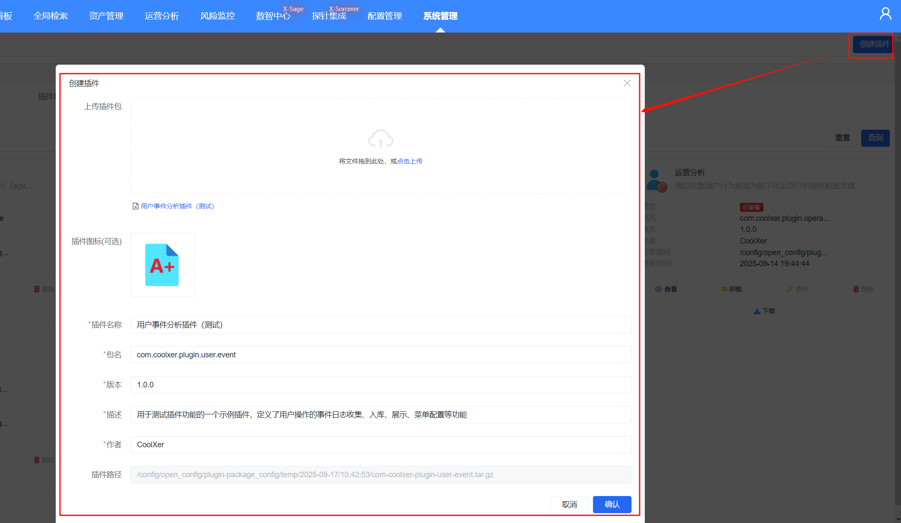  
*图3：插件管理界面，支持插件的上传和基本信息查看*

添加插件后，可以安装插件，如下图所示：
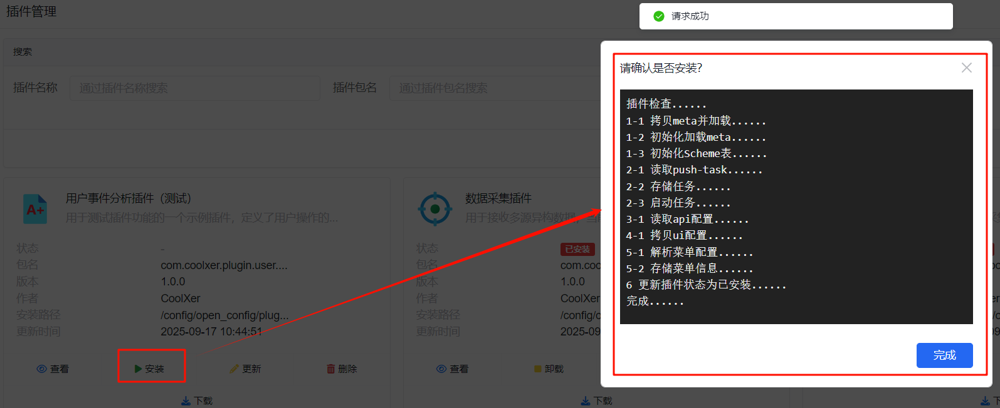  
*图4：插件安装界面，展示插件安装进度和状态*

插件安装成功后，会自动生成并添加生成元数据，如下图所示：
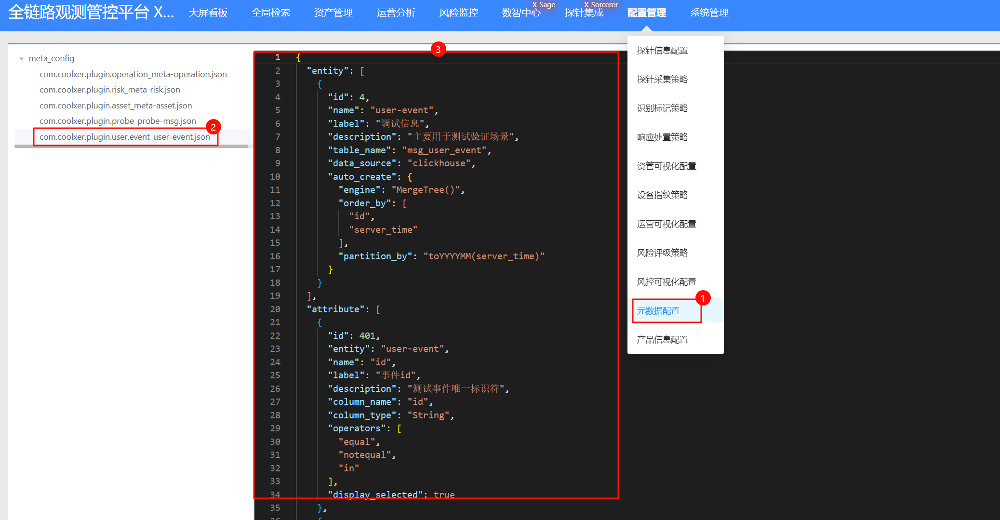  
*图5：插件安装成功后自动生成的元数据信息*

插件安装成功后，会自动生成并添加检索实体，如下图所示：
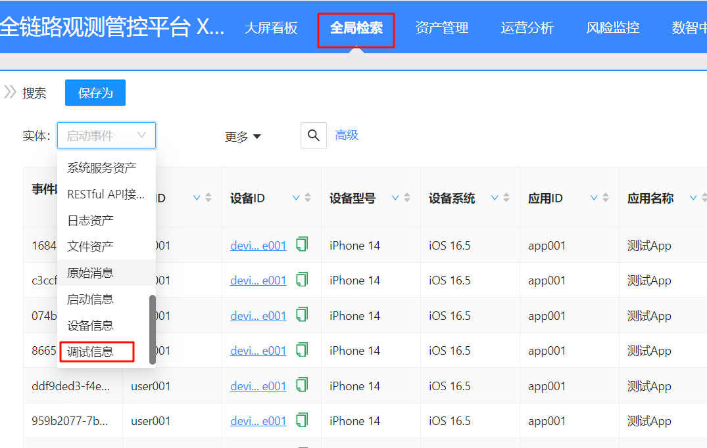  
*图6：插件安装后自动添加到全局检索的数据实体*

插件安装成功后，会自动生成并添加数推服务，如下图所示：
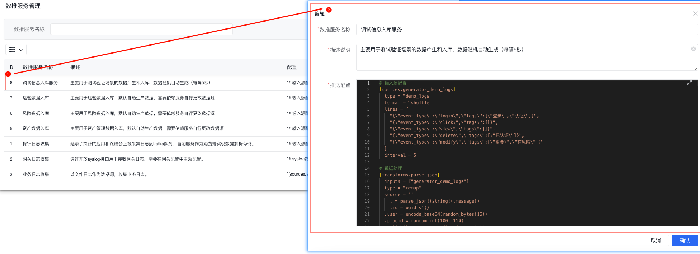  
*图7：插件安装后自动配置的数据推送服务*

插件安装成功后，根据插件自身需求可选择生成扩展接口。

插件安装成功后，会自动生成应用配置，如下图所示：
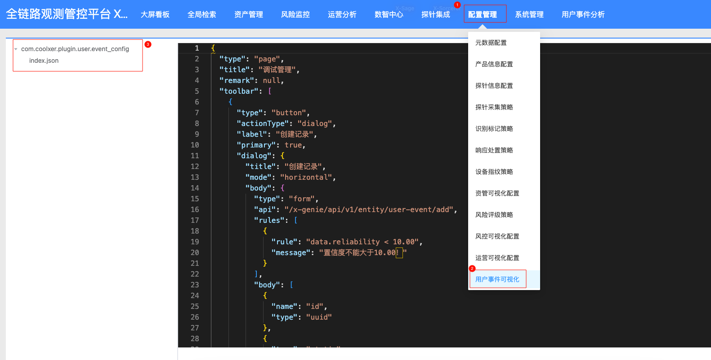  
*图8：插件安装后自动生成的应用配置信息*

插件安装成功后，会自动生成并添加菜单，如下图所示：
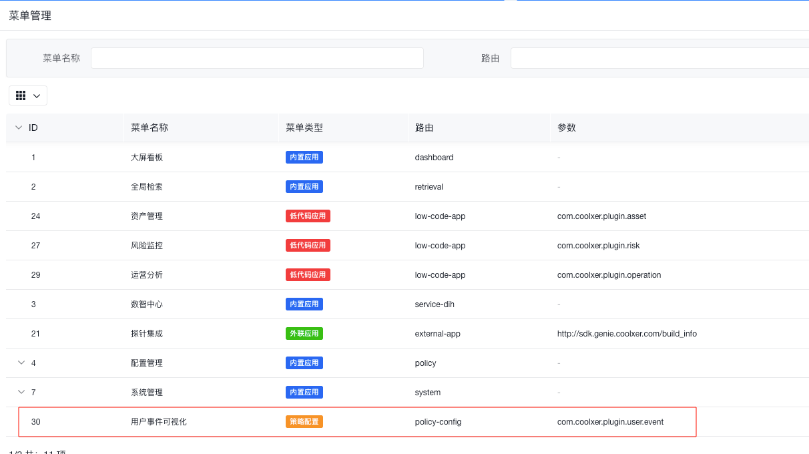  
*图9：插件安装后自动生成的系统菜单项*

需要手动操作修改菜单，调整到合适位置，如下图所示：
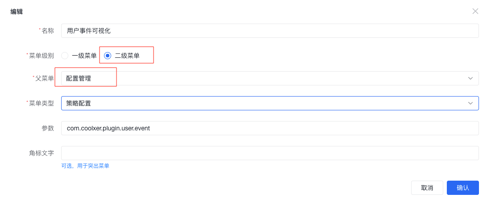  
*图10：菜单位置调整界面，可将插件菜单移动到合适位置*

需要手动添加菜单权限到角色，如下图所示：
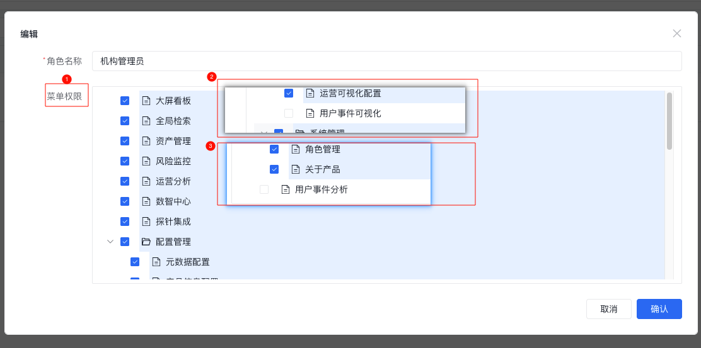  
*图11：为角色分配插件菜单访问权限的配置界面*

权限增加之后，重新登录该角色的账号，即可看到该插件的菜单及应用：
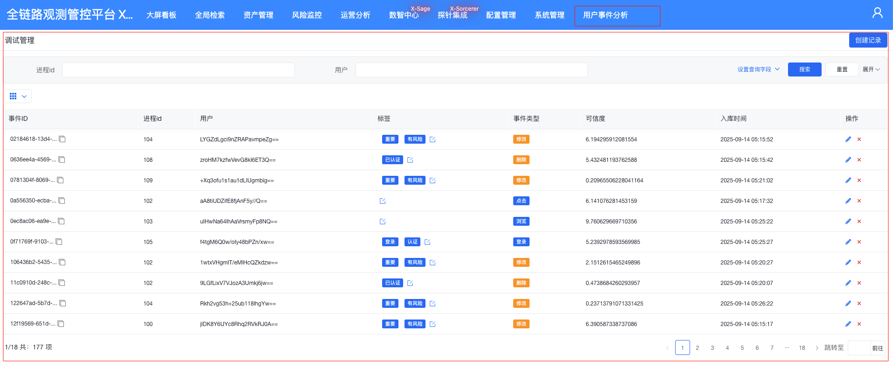  
*图12：具有权限的用户登录后可以看到插件功能界面*

# 如何制作插件

1. 创建空插件，通过在插件管理中点击创建空插件，创建一个空插件。
2. 插件信息填写，填写插件信息。
3. 将已经添加的插件下载，就得到一个插件模版，模版中包含插件的目录结构。
4. 根据自己的需求修改插件内容后，重新打包成tar.gz文件。
5. 打包后的插件就可以上传到ZenVis系统，安装使用。