# 资产管理

数据资产自动化整合系统是一个高效的数据管理平台，旨在通过自动化手段对接探针采集的资产数据，并对这些资产进行精细化管理。  
系统涵盖了硬件类资产（如服务器主机、移动端设备、PC机、IOT设备）、软件类资产（如探针SDK、APP应用、系统服务、API接口）以及数据类资产（如日志、文件）。通过资产归类、标记、上下线管理、重要性评定和风险等级评定等功能，系统能够为企业提供全面、清晰且有序的数据资产视图，从而提升数据资产的利用效率和管理效能。
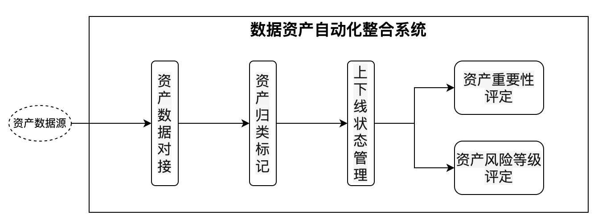  

# 核心功能

### 资产数据对接

**功能描述：**
作为系统的数据入口，负责与各类探针采集的数据源进行无缝对接。探针作为数据采集的前端工具，能够实时收集资产的运行状态、使用情况以及生成的数据信息，并将这些数据传输至系统。

**技术要点：**
- 支持多种数据传输协议（如HTTP、HTTPS、MQTT等）和接口（如API接口、消息队列等），确保能够高效、稳定地接收来自不同探针的数据
- 具备数据校验和纠错机制，保障对接数据的准确性和完整性

### 资产归类标记

**功能描述：**
根据预设的分类规则和标记模板，对采集到的资产数据进行自动归类和标记。归类包括硬件类、软件类和数据类资产，标记则用于进一步区分和标识资产的属性、用途、状态等信息。

**技术要点：**
- 采用灵活的分类算法和规则引擎，可以根据资产的特征属性（如设备类型、软件名称、数据格式等）进行智能分类
- 提供丰富的标记类型和模板，支持文本标记、标签标记、颜色标记等多种形式
- 支持用户自定义分类规则和标记模板，以满足不同企业的个性化需求

### 上下线状态管理

**功能描述：**
实时监控资产的上下线状态，记录资产的上线时间和下线时间，并对资产的上下线情况进行统计和分析。对于硬件设备，可以监测其是否正常运行；对于软件应用，可以跟踪其是否处于活跃状态；对于数据类资产，可以检测其是否在持续生成和更新。

**技术要点：**
- 通过与探针的实时通信，获取资产的在线状态信息。采用心跳机制或定期轮询的方式，及时发现资产的上下线变化
- 将上下线状态信息记录到系统数据库中，并提供可视化的上下线状态展示界面，方便用户直观地查看资产的实时状态

### 资产重要性评定

**功能描述：**
根据资产的业务价值、使用频率、依赖关系等因素，对资产的重要性进行评定。评定结果可以用于资源分配、优先级排序和风险管理等场景。

**技术要点：**
- 设计多维度的评定模型，包括业务价值、使用频率、依赖关系、数据敏感性等指标
- 支持用户自定义评定规则和权重，以适应不同企业的业务需求
- 提供可视化的重要性评定结果展示，帮助用户快速了解资产的重要程度

### 资产风险等级评定

**功能描述：**
基于资产的安全性、稳定性、合规性等因素，对资产的风险等级进行评定。评定结果可以用于安全策略制定、风险预警和应急响应等场景。

**技术要点：**
- 设计风险评估模型，综合考虑资产的安全漏洞、配置缺陷、违规行为等因素
- 支持实时风险监测和动态风险评估，及时发现潜在风险
- 提供风险预警功能，通过邮件、短信等方式通知管理员风险情况，并提供相应的应对建议

# 系统优势

- **自动化程度高**：通过与探针的无缝对接和智能化的算法设计，系统能够自动完成资产的归类、标记、上下线管理、重要性评定和风险等级评定等操作，大大减少了人工干预的工作量，提高了数据资产整合的效率和准确性

- **全面覆盖各类资产**：涵盖了硬件类、软件类和数据类等多种类型的资产，能够满足企业或组织对不同类型数据资产的管理需求，为企业提供一个全面、统一的数据资产视图

- **灵活性强**：支持用户自定义分类规则、标记模板、评定规则等，能够根据不同企业的业务特点和管理需求进行灵活配置，具有很强的适应性和可扩展性

- **实时性和可视化**：实时监控资产的状态和数据变化情况，并通过可视化界面直观地展示资产的分类、标记、关联、重要性评定和风险等级评定等信息，方便用户快速了解数据资产的整体情况，及时发现问题并做出决策

# 应用场景

数据资产自动化整合系统广泛应用于企业的信息化管理、数据中心运维、网络安全监控、数据分析等领域。例如：

- **数据中心运维**：通过实时监控资产的上下线状态和重要性评定，快速定位故障设备和关键资产，提高运维效率

- **网络安全监控**：基于资产风险等级评定，及时发现潜在的安全威胁，制定针对性的安全策略

- **数据分析**：通过对资产数据的整合和关联分析，结合重要性评定结果，为企业提供更深入的业务洞察和决策支持

总之，数据资产自动化整合系统是一个高效、智能、灵活的数据资产管理工具，能够帮助企业更好地管理和利用数据资产，提升企业的数字化运营水平和竞争力。


# 功能介绍

## 数据源对接

本系统依靠开源的工具vector实现数据源对接，相关使用说明请参考[vector官网](https://vector.dev)，使用步骤示例如下：

### 配置文件编写

Vector 的配置文件是 vector.toml，它定义了日志的来源（sources）、处理（transforms）和目的地（sinks）。以下是一个完整的配置示例，展示如何从本地日志文件收集日志并存储到 ClickHouse对应的库表。

```
[sources.source_log_file]
type = "file"
data_dir = "/vector/log_file_checkpoint"
include = [ "/risk-service/logs/info.log" ]

[transforms.transform_filter]
type = "filter"
inputs = [ "source_log_file" ]
condition = { type = "vrl", source = '''
contains(string!(.message),"DeviceIndexController - system_log:")
''' }

[transforms.parse_json]
  inputs        = ["transform_filter"]
  type          = "remap"
  drop_on_error = false
  source        = '''
      .fact = del(.)
      .system_log_array, err = split(.fact.message, "system_log:")
      .log_array, err = split(.system_log_array[1], ",")
      .app_id = .log_array[0]
      .guid = .log_array[1]
      .start_id = .log_array[2]
      .platform = .log_array[3]
      .user_id = .log_array[4]
      .fact_type = "system_log"
      del(.system_log_array)
      del(.log_array)
  '''

# 输出目标配置
[sinks.my_clickhouse_sink]
type = "clickhouse"
inputs = ["parse_json"]
endpoint = "http://clickhouse-service:8123"
database = "open_risk"
table = "msg"
auth.strategy = "basic"
auth.user = "default"
auth.password = "cooltom@123"
skip_unknown_fields = true

# 输出数据到日志
[sinks.console]
inputs = ["parse_json"]
type = "console"
encoding.codec = "json"
```

### 启动数据导入

使用配置文件启动vector导入数据：

```
vector --config /path/to/vector.toml
```

## 资产概览

数据资产概览页面是数据资产自动化整合系统的核心界面，用于展示系统中各类数据资产的总量、趋势和风险等级。用户可以通过该页面快速了解数据资产的整体情况，并进行相应的管理和操作。

**主要功能模块：**
- 顶部统计栏：显示各类资产的总量，包括服务器设备、移动设备、PC端设备、探针资产、应用资产、API资产、日志数据、文件数据等
- 活跃资产趋势图：展示不同类型资产在一段时间内的数量变化趋势
- 资产等级总览：以表格形式展示不同类型资产的数量，按风险等级（无风险、低风险、中风险、高风险、极高风险）进行分类
- 资产风险总览：以表格形式展示不同类型资产的风险等级分布情况

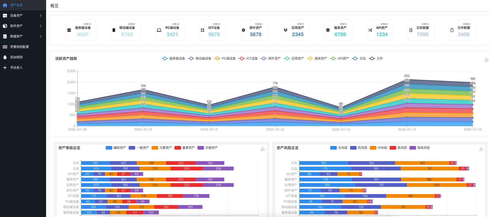

## 资产管理规则

数据资产自动化整合系统的"规则列表"页面主要用于管理和配置资产相关的规则。

**主要功能：**
- 规则列表查看：通过左侧导航条进入资管规则配置页面，可以查看全部规则列表，支持分页查询
- 添加规则：点击添加规则按钮可以添加新的资产规则
- 筛选和搜索：支持通过资产、执行、状态等下拉菜单选择筛选条件，也支持关键词搜索
- 批量操作：选择多个规则后，可以批量删除选中的规则
- 规则详情查看：点击规则列表中的某一行，可以查看该规则的详细信息
- 规则编辑：在规则详情页面，可以修改选中的规则
- 规则删除：在规则详情页面，可以删除选中的规则

通过这个页面，用户可以方便地管理资产规则，包括添加新规则、查看规则详情、修改和删除规则，以及通过筛选和搜索功能快速找到特定的规则。这有助于用户有效地监控和管理数据资产，确保资产的安全和合规。

**资管规则列表：**
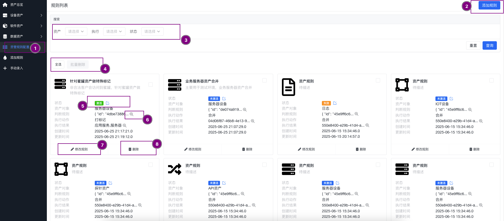

**资管规则添加：**
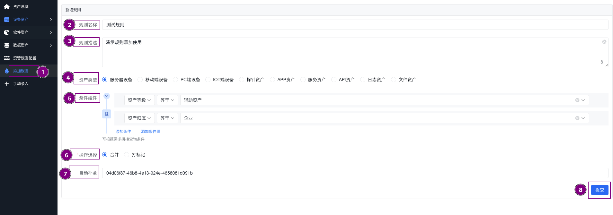

**资管规则修改：**
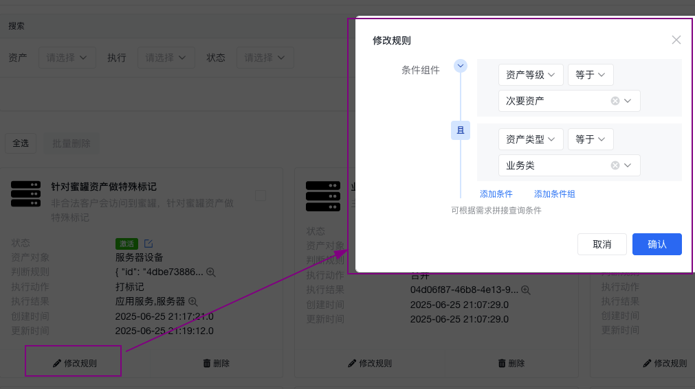

**资管规则删除：**
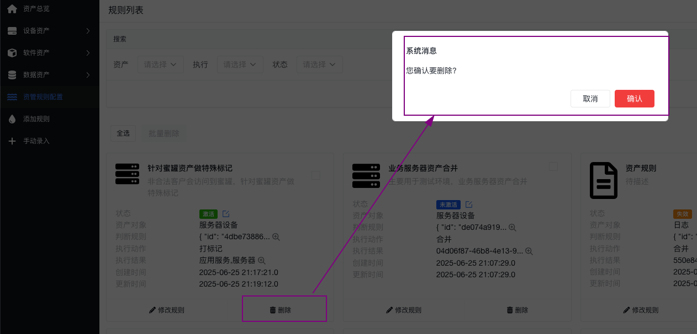

## 服务器主机资产管理

数据资产自动化整合系统的"服务器设备管理"页面主要用于管理和查看服务器设备的详细信息。

**主要功能：**
- 资产列表查看：通过左侧导航条进入页面，可以查看全部资产列表，支持分页查询
- 手动录入：点击手动录入按钮可以手动添加新的服务器设备信息
- 筛选和搜索：支持多种筛选条件，如活跃时间、标签、操作系统、厂商、型号、位置、机房、机柜、机位、外网IP、内网IP、重要等级、风险等级、来源、资产类型、属主、是否开放、状态等
- 批量操作：包括批量修改和批量删除功能，用户可以选择多个设备后进行批量操作
- 详细信息展示：显示所有符合条件的服务器设备信息，包括资产ID、活跃时间、标签、厂商、型号、操作系统、系统版本、架构、CPU型号、外网IP、内网IP、重要等级、风险等级等
- 单项操作：每个设备条目后面有操作按钮，包括查看、修改和删除

**页面说明：**

**主机资产管理页面：**
该页面展示所有服务器主机资产的列表视图，用户可以在此页面进行筛选、搜索和批量操作。通过表格形式清晰展示各项关键信息，便于快速浏览和管理大量主机资产。
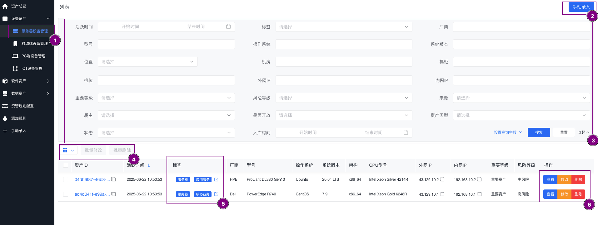

**主机资产添加页面：**
用于手动添加新的服务器主机资产信息。提供完整的表单字段，包括基础信息、网络配置、硬件规格等，确保资产信息的完整性和准确性。
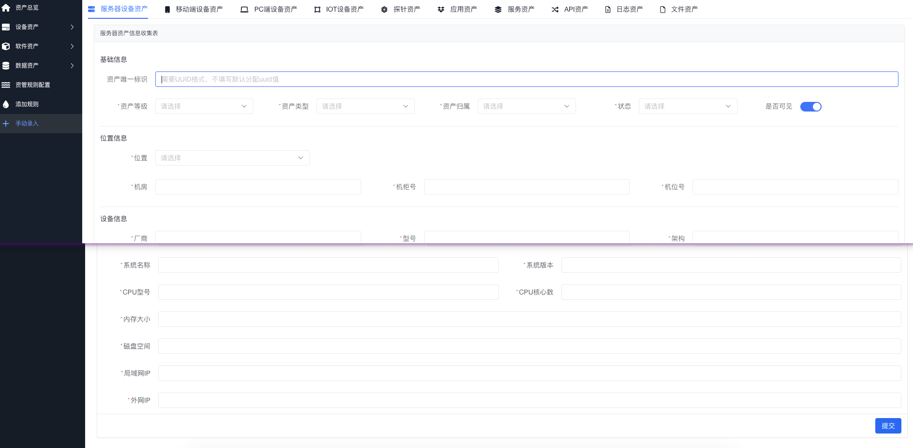

**主机资产详情页面：**
展示特定主机资产的详细信息，包括所有属性字段和关联信息。用户可以在此页面全面了解资产的各项指标和状态，支持导出和打印功能。
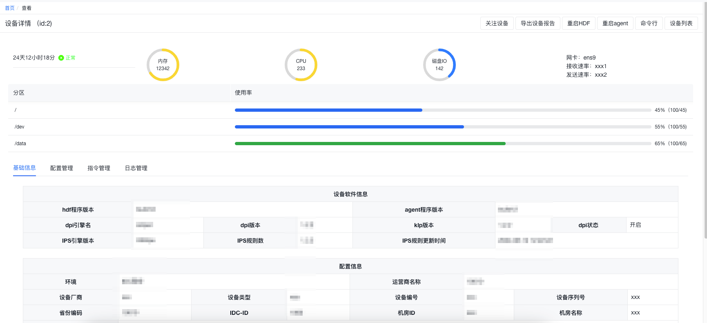

**主机资产修改页面：**
允许用户编辑现有主机资产的信息。提供与添加页面相同的表单，但已填充当前资产数据，便于快速更新和修正资产信息。
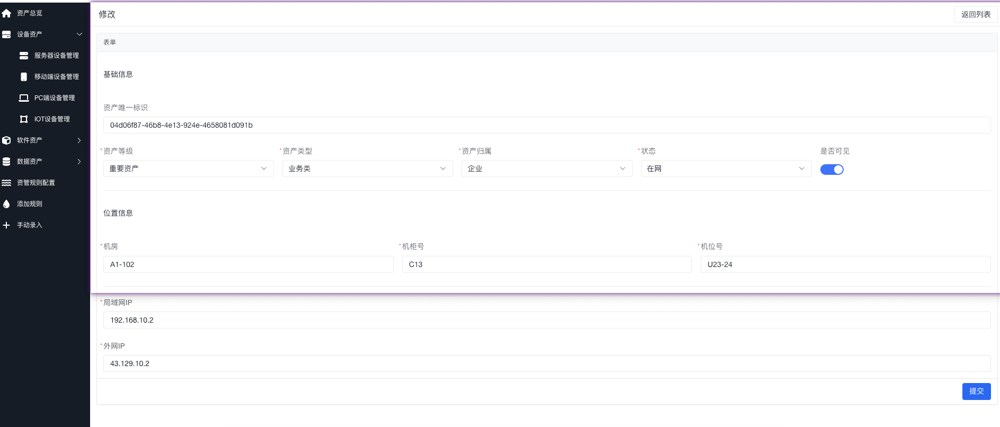

**主机资产删除页面：**
提供删除确认功能，防止误操作。在删除前会显示资产的关键信息，并要求用户确认操作，确保数据安全。
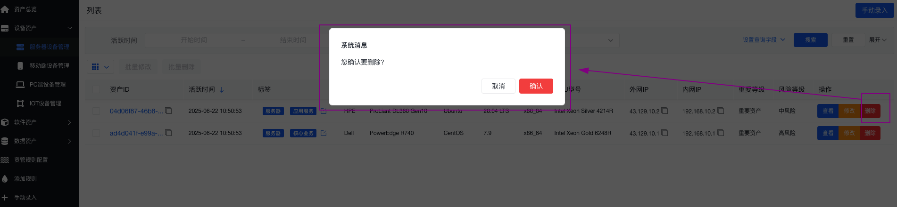

**主机资产标签管理页面：**
用于管理和配置主机资产的标签。支持创建、编辑和删除标签，以及为资产分配标签。通过标签可以更好地分类和筛选资产。
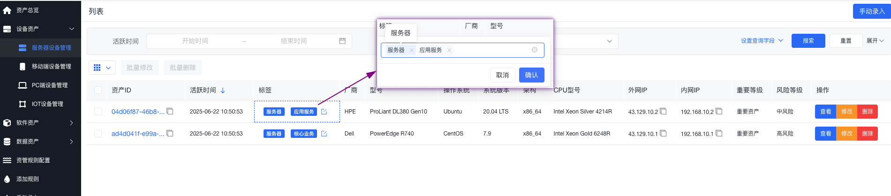

## 移动端设备资产管理

数据资产自动化整合系统中的"移动端设备管理"界面，旨在帮助用户管理和监控移动设备资产。  
页面提供了设备的详细信息列表，包括资产ID、活跃时间、标签（如移动设备、办公手机）、厂商、型号、操作系统、系统版本、设备形态、屏幕分辨率、外网IP、内网IP、重要等级和风险等级等。用户可以通过筛选条件来搜索特定设备，也可以利用批量操作功能对多个设备进行修改或删除。每个设备条目后面都有操作按钮，允许用户查看详细信息、修改设备信息或删除设备记录，从而实现对移动端设备资产的有效管理和维护。

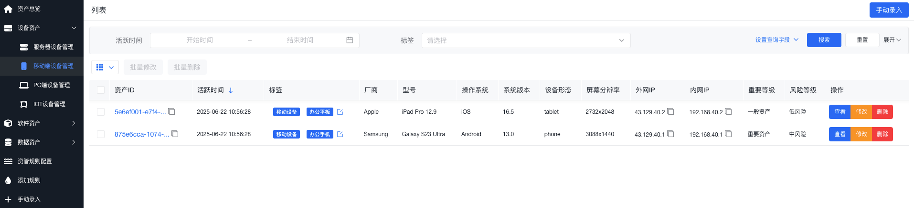

## PC机资产管理

数据资产自动化整合系统中的"PC端设备管理"模块，旨在为用户提供一个直观的界面来管理和监控PC端设备资产。  
页面列出了设备的详细信息，包括资产ID、活跃时间、设备标签（如办公电脑、设计电脑）、厂商、型号、操作系统、系统版本、架构、CPU型号、显示器品牌、外网IP、内网IP、重要等级和风险等级等。用户可以通过设置筛选条件来搜索特定设备，或使用批量操作功能来同时修改或删除多个设备记录。每个设备条目都配备了操作按钮，允许用户查看详细信息、修改设备信息或删除设备，从而实现对PC端设备资产的高效管理和维护。

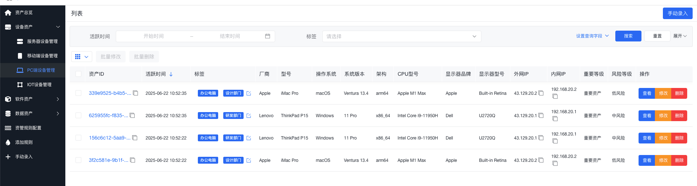

## IOT设备资产管理

数据资产自动化整合系统中的"IOT设备管理"模块，专门用于管理和监控物联网(IOT)设备资产。  
页面展示了IOT设备的详细信息列表，包括资产ID、活跃时间、设备标签（如智能网、监控设备）、厂商、型号、设备名称、设备类型、设备序列号、固件版本、外网IP、内网IP、重要等级和风险等级等。用户可以通过设置筛选条件来搜索特定设备，或使用批量操作功能对多个设备进行修改或删除。每个设备条目都配备了操作按钮，允许用户查看详细信息、修改设备信息或删除设备，从而实现对IOT设备资产的有效管理和维护。  
这一模块有助于用户保持对IOT设备状态的清晰认识，确保设备的安全和高效运行。

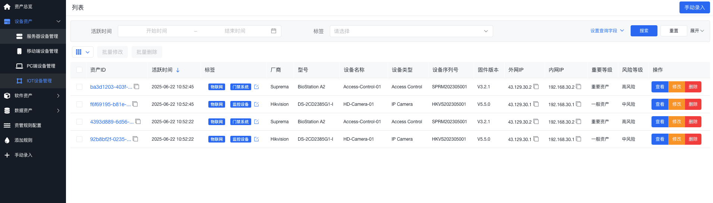

## 探针SDK资产管理

数据资产自动化整合系统中的"探针管理"模块，用于管理和监控不同平台上的探针资产。  
探针是用于收集和传输数据的软件组件，它们可以部署在各种环境中以监控和分析数据流。页面列出了探针的详细信息，包括资产ID、活跃时间、标签（如SDK、Android、iOS）、探针名称、探针版本、探针类型、文件MD5值、开发语言、框架、兼容版本、重要等级和风险等级等。用户可以通过设置筛选条件来搜索特定探针，或使用批量操作功能对多个探针进行修改或删除。每个探针条目都配备了操作按钮，允许用户查看详细信息、修改探针信息或删除探针，从而实现对探针资产的有效管理和维护。  
这一模块有助于用户确保探针的正确部署和运行，以支持数据收集和分析的需要。

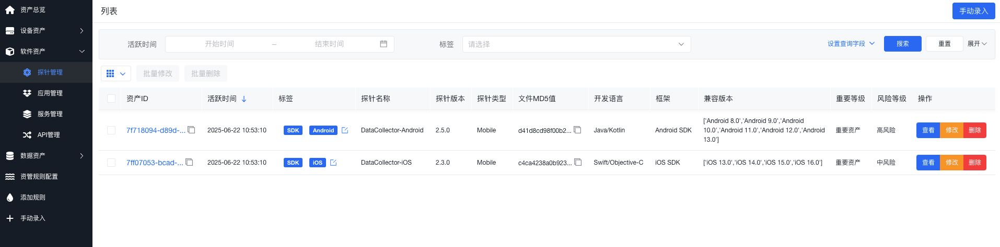

## 应用程序资产管理

数据资产自动化整合系统中的"应用管理"模块，专注于管理和监控企业内部使用的各种应用程序。  
页面以列表形式展示了应用程序的详细信息，包括资产ID、活跃时间、标签（如应用、办公工具、安全加固）、应用名称、应用版本、应用类型、包名、平台（如iOS、Android）、开发者、发布时间、文件MD5值、重要等级和风险等级等。用户可以通过设置筛选条件来搜索特定应用，或使用批量操作功能对多个应用进行修改或删除。每个应用条目都配备了操作按钮，允许用户查看详细信息、修改应用信息或删除应用，从而实现对应用资产的有效管理和维护。  
这一模块有助于用户确保应用的合规性和安全性，同时优化应用性能和用户体验。

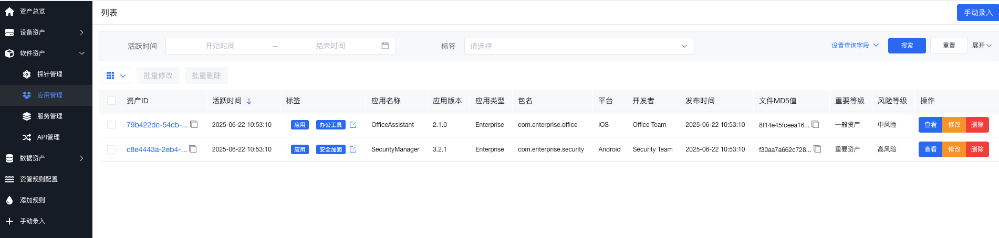

## 系统服务资产管理

数据资产自动化整合系统的"服务管理"模块，旨在帮助用户管理和监控系统中的服务资产。  
页面展示了服务的详细信息列表，包括资产ID、活跃时间、标签（如服务、网关、认证服务）、服务名称、版本、类型、进程名称、进程ID、运行环境、启动命令、启动参数、重要等级和风险等级等。用户可以通过设置筛选条件来搜索特定服务，或使用批量操作功能对多个服务进行修改或删除。每个服务条目都配备了操作按钮，允许用户查看详细信息、修改服务配置或删除服务，从而实现对服务资产的有效管理和维护。  
这一模块有助于用户确保服务的稳定运行和安全性，同时优化服务性能和资源利用。

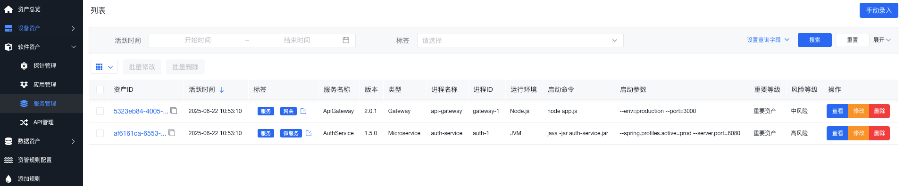

## API接口资产管理

数据资产自动化整合系统中的"API管理"模块，专门用于管理和监控系统中的API接口。  
页面以列表形式展示了API的详细信息，包括资产ID、活跃时间、标签（如API）、名称、版本、路径、方法（如POST、GET）、内容类型、请求参数、是否已弃用、重要等级和风险等级等。用户可以通过设置筛选条件来搜索特定API，或使用批量操作功能对多个API进行修改或删除。每个API条目都配备了操作按钮，允许用户查看详细信息、修改API配置或删除API，从而实现对API资产的有效管理和维护。  
这一模块有助于用户确保API的安全性、稳定性和性能，同时优化API的使用和监控。

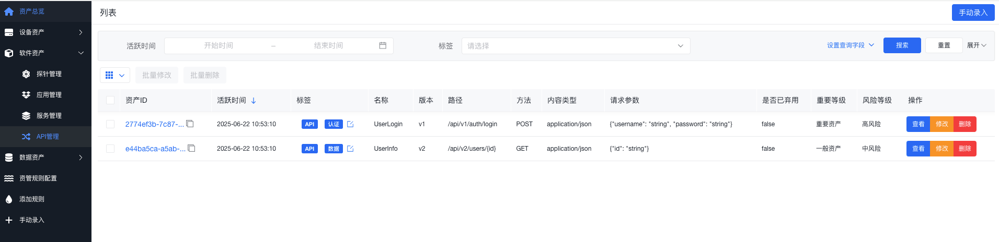

## 日志资产管理

数据资产自动化整合系统中的"日志资产"模块，用于管理和监控系统中生成的日志数据。  
页面展示了日志的详细信息列表，包括资产ID、活跃时间、标签（如日志、系统运行、网络安全）、日志时间、进程信息、日志级别（如WARNING、CRITICAL、ERROR、INFO）、日志信息、重要等级和风险等级等。用户可以通过设置筛选条件来搜索特定日志，或使用批量操作功能对多个日志条目进行查看或删除。每个日志条目都配备了操作按钮，允许用户查看日志的详细信息、修改日志配置或删除日志，从而实现对日志资产的有效管理和维护。  
这一模块有助于用户及时了解系统的运行状态，快速定位和解决问题，同时确保系统的安全性和稳定性。

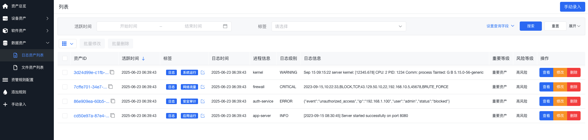


## 文件资产管理

数据资产自动化整合系统中的"文件资产列表"模块，旨在帮助用户管理和监控系统中的文件资产。  
页面以表格形式展示了文件的详细信息，包括资产ID、活跃时间、标签（如日志文件、配置文件、数据文件、证书文件）、文件名称、文件类型（如ARCHIVE、CONFIG、DATA、CERTIFICATE）、文件路径、是否压缩、文件哈希值、重要等级和风险等级等。用户可以通过设置筛选条件来搜索特定文件，或使用批量操作功能对多个文件进行查看、修改或删除。每个文件条目都配备了操作按钮，允许用户查看文件的详细信息、修改文件属性或删除文件，从而实现对文件资产的有效管理和维护。  
这一模块有助于用户确保文件的安全性和完整性，同时优化文件的存储和访问。

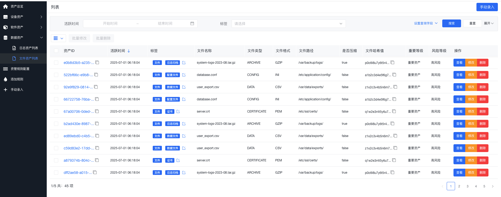