# 运营分析

数字化运营支撑系统是企业数字化转型的核心工具，通过整合数据、流程和技术，帮助企业提升运营效率、优化决策并实现业务创新。该系统不仅整合了数据、技术和业务流程，而且是企业战略与运营模式的数字化体现，帮助企业实现"数据驱动决策"和"流程自动化"。

# 核心功能

运营分析系统主要包含以下功能模块：

- 行为事件：跟踪和分析用户在应用或网站上的行为，如点击、滑动、输入等
  - 启动事件：监控应用或网站的启动情况，分析启动时间、启动次数等
  - 点击事件：记录用户点击操作，帮助分析用户交互行为
  - 页面访问事件：跟踪用户访问的页面，分析页面访问量、停留时间等
  - 函数调用事件：监控应用中函数的调用情况，分析函数执行效率和错误率
  - 网络请求事件：跟踪应用发起的网络请求，分析请求成功率、响应时间等
  - 用户扩展事件：允许用户自定义事件，以便更灵活地收集和分析数据

- 状态指标：展示应用的关键性能指标，如资源利用率、地理位置分布等
  - 资源利用率：监控应用资源的使用情况，如CPU、内存、带宽等
  - 地理位置：展示用户或资源的地理位置分布

- 应用质量：监控应用的质量，包括崩溃率、错误率等
  - 崩溃列表：展示应用发生的崩溃事件，帮助开发者快速定位问题
  - ANR列表：ANR（Application Not Responding）是指应用无响应，展示应用的ANR事件，帮助开发者优化应用性能

这个系统通过这些模块提供了一个全面的运营分析平台，帮助开发者和运营团队监控应用性能，分析用户行为，从而优化用户体验和提升运营效率。

# 系统优势

- **提升运营效率**：通过流程自动化和智能决策支持，减少人工干预，提高运营效率
- **优化决策**：通过数据整合与分析，提供洞察，帮助企业做出更精准的决策
- **实现业务创新**：通过整合数据、流程和技术，帮助企业实现业务创新
- **数据驱动决策**：通过实时监控与分析，支持数据驱动的决策过程
- **增强用户体验**：通过用户交互管理，提升用户体验

# 应用场景

- **制造业**：生产优化，如生产线的实时监控和预测性维护，将设备故障率降低
- **零售业**：客户洞察，如分析客户购买行为，优化商品陈列，提升销售额
- **金融业**：风险管理，如实现对贷款申请的实时评估，降低风险
- **物流行业**：自动化处理订单、仓储和配送流程，提升效率
- **人力资源**：自动化处理招聘、入职和绩效评估流程，减少人力成本
- **教育行业**：为学生和教师提供个性化学习平台
- **政府服务**：为市民提供便捷的在线服务入口

# 功能介绍

## 数据源对接

本系统依靠开源工具 Vector 实现数据源对接，相关使用说明请参考 [Vector 官网](https://vector.dev)。

### 配置文件编写

Vector 的配置文件是 vector.toml，它定义了日志的来源（sources）、处理（transforms）和目的地（sinks）。以下是一个完整的配置示例，展示如何从本地日志文件收集日志并存储到 ClickHouse 对应的库表。

```
[sources.source_log_file]
type = "file"
data_dir = "/vector/log_file_checkpoint"
include = [ "/risk-service/logs/info.log" ]

[transforms.transform_filter]
type = "filter"
inputs = [ "source_log_file" ]
condition = { type = "vrl", source = '''
contains(string!(.message),"EventIndexController - system_log:")
''' }

[transforms.parse_json]
  inputs        = ["transform_filter"]
  type          = "remap"
  drop_on_error = false
  source        = '''
      .fact = del(.)
      .system_log_array, err = split(.fact.message, "system_log:")
      .log_array, err = split(.system_log_array[1], ",")
      .app_id = .log_array[0]
      .guid = .log_array[1]
      .start_id = .log_array[2]
      .platform = .log_array[3]
      .user_id = .log_array[4]
      .fact_type = "system_log"
      del(.system_log_array)
      del(.log_array)
  '''

# 输出目标配置
[sinks.my_clickhouse_sink]
type = "clickhouse"
inputs = ["parse_json"]
endpoint = "http://clickhouse-service:8123"
database = "open_risk"
table = "msg"
auth.strategy = "basic"
auth.user = "default"
auth.password = "cooltom@123"
skip_unknown_fields = true

# 输出数据到控制台（调试用）
[sinks.console]
inputs = ["parse_json"]
type = "console"
encoding.codec = "json"
```

### 启动数据导入

使用配置文件启动 Vector 导入数据：

```
vector --config /path/to/vector.toml
```

## 运营分析面板

运营分析作为系统的核心功能，是企业实现数据驱动决策的关键。它不仅支持对收集的日志数据进行多维度的指标分析，而且能够将分析结果以直观的面板形式展现，从而帮助企业快速洞察业务运营状况，优化决策过程。

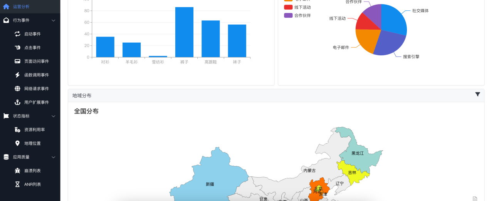

首次安装时，默认面板是空的。需要打开编辑模式，即可进入编辑状态。

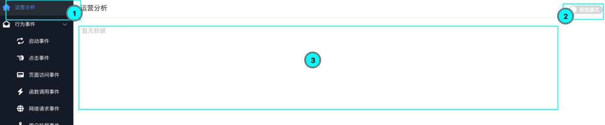

在编辑状态下，点击添加按钮添加分析面板。

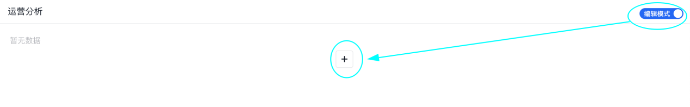

### 选择分析方法

分析面板首先需要选择分析方法，支持以下几种类型：
- 事件分析
- 漏斗分析
- 分布分析
- 路径分析

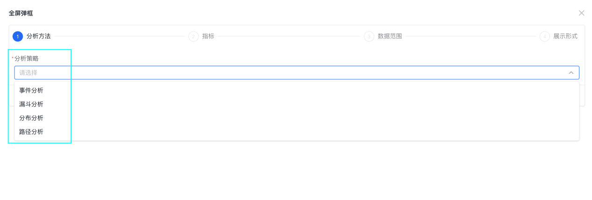

### 选择分析指标

选择完分析方法后，下一步是选择分析指标。指标包含：

- 事件：用户注册、浏览商品、添加购物车、支付等多种用户事件
- 具体指标：事件次数、独立用户数、人均次数、转化率等指标

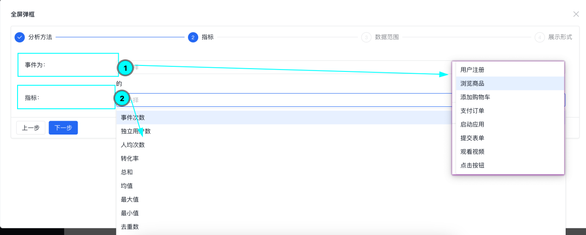

### 设置数据范围

选择分析的数据范围，支持添加条件组以及条件条目。条件的可选维度包含用户指标、指标值、设备类型、地理位置等，条件根据不同的指标包含为空、匹配、模糊匹配等多种条件。

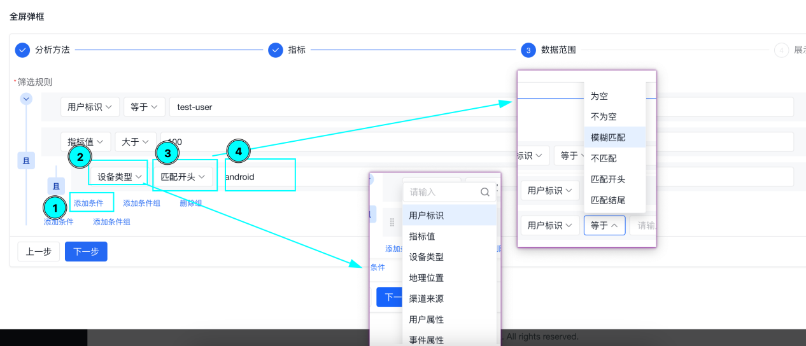

### 选择展现方式

最后选择展现方式，当前支持多种展现形式：
- 饼图
- 柱状图
- 折线图
- 漏斗图
- 地图分布

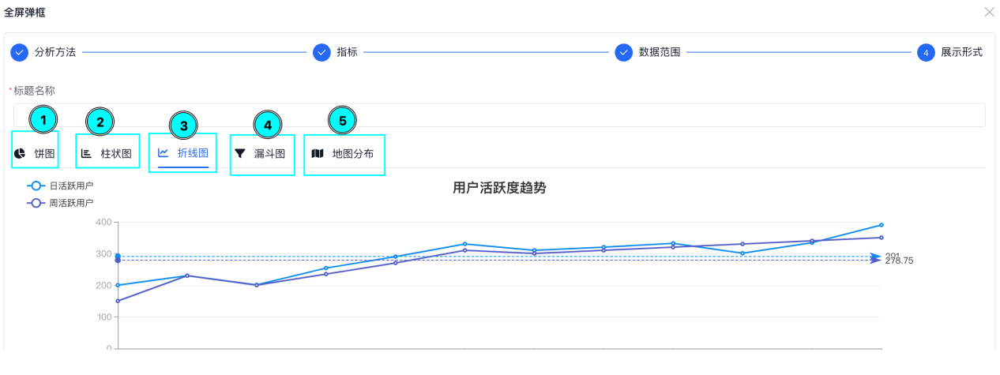

配置完成后，面板就会添加到运营分析面板上。在编辑模式下，可以看到编辑、删除、右侧添加、下方添加等按钮，支持继续添加更多面板。

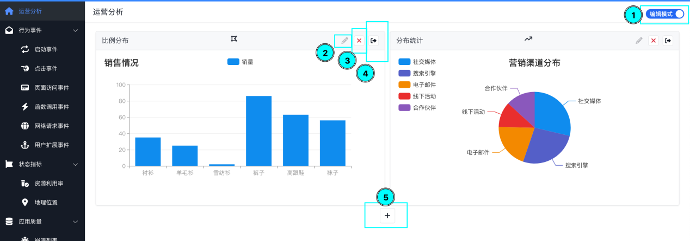

## 启动事件分析

程序启动事件追踪界面用于监控和分析应用程序或网站的行为事件。

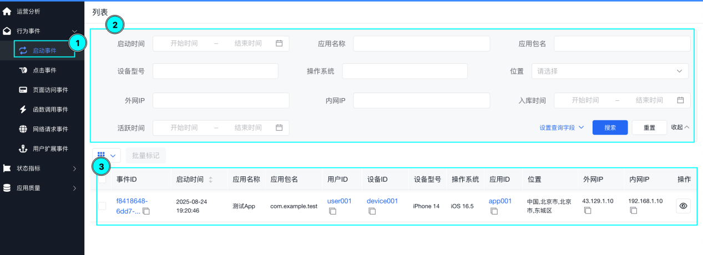

### 筛选条件

- 启动时间/结束时间：指定事件的开始和结束时间范围，筛选特定时间段内的数据
- 应用名称/应用包名：指定要分析的特定应用程序，通过应用名称或包名筛选
- 设备型号/操作系统：筛选特定设备型号或操作系统的事件数据
- 位置：筛选特定地理位置的事件数据
- 外网IP/内网IP：筛选特定IP地址的事件数据，外网IP通常指公网IP，内网IP指局域网IP
- 入网时间/离开时间：筛选用户进入和离开应用的时间点
- 运营商：筛选特定网络运营商的事件数据

操作按钮包括"查询"、"重置"和"收起"按钮，用于执行筛选操作、重置筛选条件或收起筛选条件区域。

### 数据表格

数据表格展示以下信息：

- 事件ID：每个事件的唯一标识符
- 信息时间：事件发生的具体时间
- 应用名称/应用包名：发生事件的应用程序的名称和包名
- 用户ID：触发事件的用户的唯一标识符
- 设备ID：用户设备的标识符
- 设备型号/操作系统：用户设备的型号和操作系统信息
- 应用ID：应用程序的唯一标识符
- 位置：事件发生时用户的地理位置
- 外网IP/内网IP：事件发生时用户的外网和内网IP地址

该界面允许用户通过多种条件筛选事件数据，并以表格形式展示筛选结果，方便进行数据分析和监控。

## 点击事件分析

点击事件分析界面提供了一个专门用于追踪和分析用户点击行为的工具。

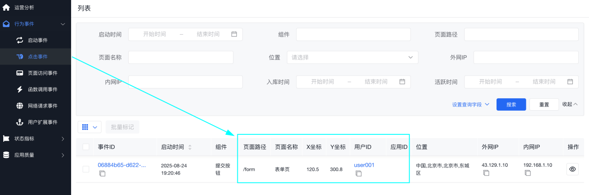

通过该界面可以分析用户在应用中的点击行为，包括点击位置、点击频率、点击路径等，帮助优化用户界面设计和用户体验。

## 页面访问事件分析

页面访问事件分析用于跟踪用户访问的页面，分析页面访问量、停留时间等指标。

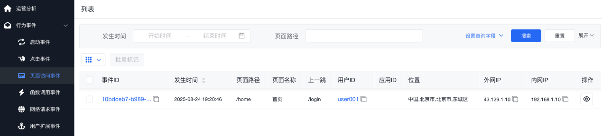

该功能可以帮助运营团队了解用户偏好，优化页面布局和内容，提高用户参与度和转化率。

## 函数调用事件分析

函数调用事件分析用于监控应用中函数的调用情况，分析函数执行效率和错误率。

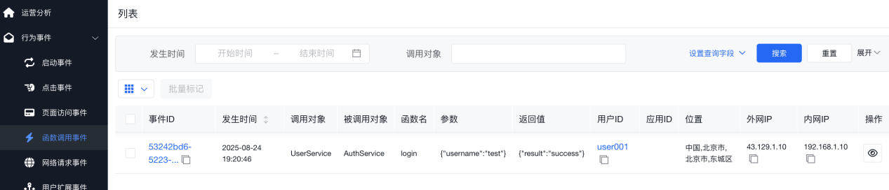

通过该功能可以识别性能瓶颈，优化代码执行效率，提高应用整体性能。

## 网络请求事件分析

网络请求事件分析用于跟踪应用发起的网络请求，分析请求成功率、响应时间等。

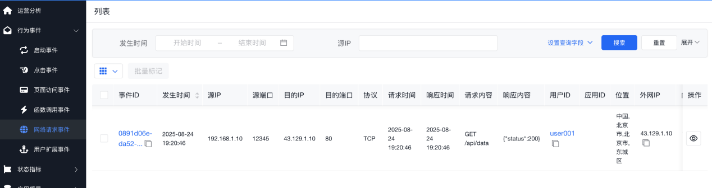

该功能可以帮助识别网络问题，优化网络请求策略，提高应用的网络通信质量。

## 用户拓展事件分析

用户拓展事件分析允许用户自定义事件，以便更灵活地收集和分析数据。

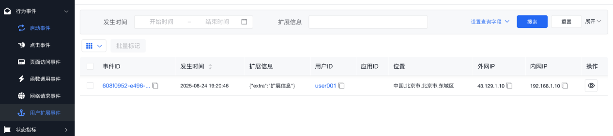

通过自定义事件，可以满足特定业务场景的分析需求，扩展系统的分析能力。

## 资源利用事件分析

资源利用事件分析用于监控应用资源的使用情况，如CPU、内存、带宽等。

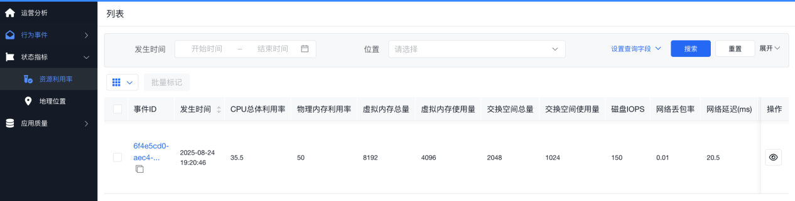

该功能可以帮助识别资源瓶颈，优化资源配置，提高系统稳定性。

## 地理位置事件分析

地理位置事件分析用于展示用户或资源的地理位置分布。

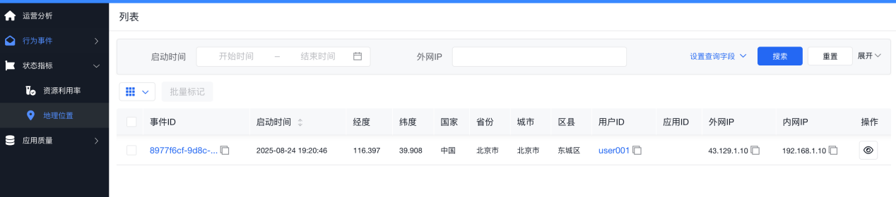

通过地理位置分析，可以了解用户分布情况，为市场策略和业务决策提供数据支持。

## 程序崩溃事件分析

程序崩溃事件分析用于展示应用发生的崩溃事件，帮助开发者快速定位问题。

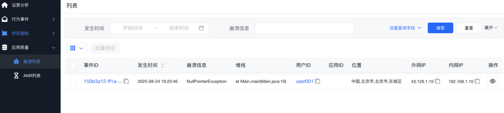

该功能可以帮助开发团队及时发现和修复程序缺陷，提高应用稳定性。

## 程序无响应事件分析

程序无响应（ANR）事件分析用于展示应用的ANR事件，帮助开发者优化应用性能。

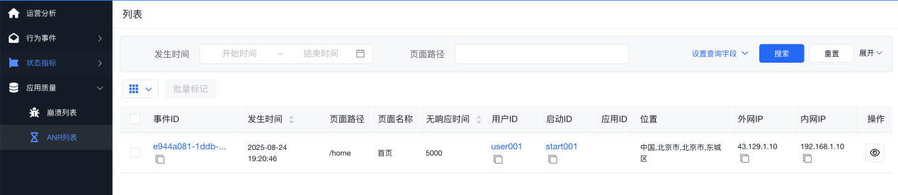

通过监控ANR事件，可以识别应用性能问题，优化用户体验。