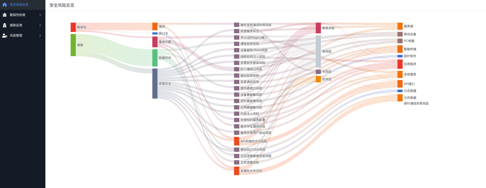
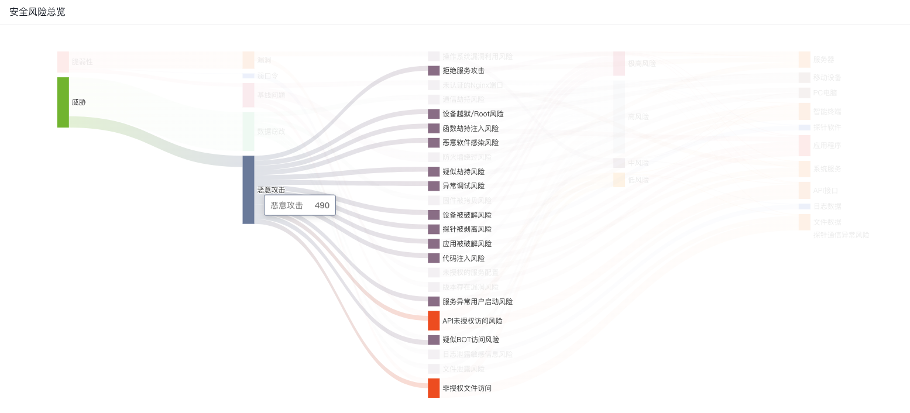
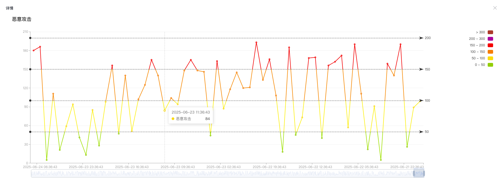
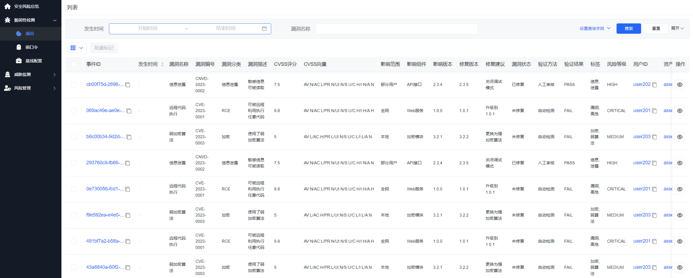
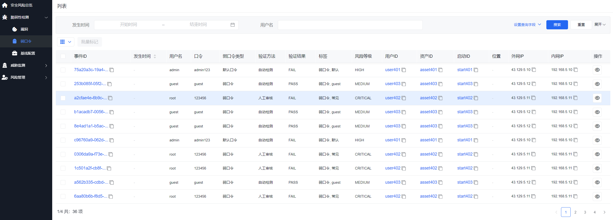
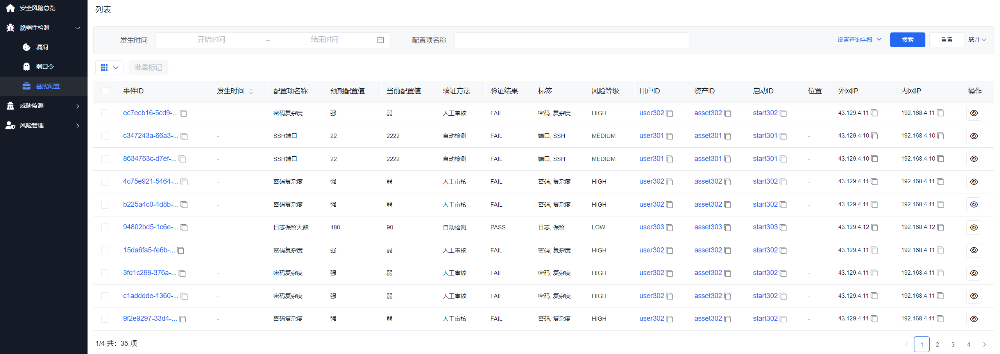
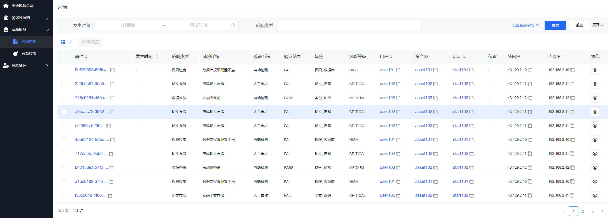
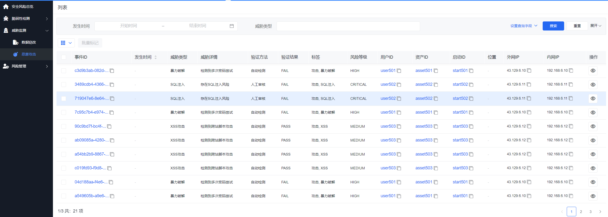
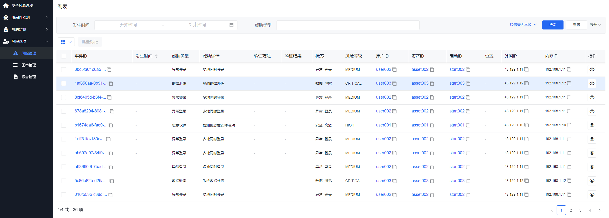
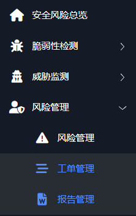

# 风险管控

在数字化转型加速、网络安全威胁日益复杂的背景下，安全风险评定系统应运而生。  
该系统以"全面感知、精准识别、动态评估、闭环管理"为核心理念，围绕脆弱性、威胁、风险三大要素，构建覆盖资产、漏洞、配置、行为等多维度的安全风险评估体系，助力企业实现安全风险的可视化、可量化、可管控，提升整体安全运营能力。

# 核心功能

## 脆弱性检测

- 自动化扫描系统漏洞、补丁缺失、弱口令等安全隐患
- 支持主流操作系统、中间件、数据库、网络设备等多平台
- 提供详细的修复建议与优先级排序
- 依据行业标准和最佳实践，对主机、网络设备、云平台等进行配置合规性检查
- 支持自定义基线模板，灵活适配不同业务场景

## 威胁监测

- 实时监测网络行为、异常流量、攻击特征等
- 内置威胁情报库，结合AI分析模型，提升威胁识别准确率
- 监控关键文件、数据库、日志等核心数据完整性
- 及时发现并告警未授权修改行为，防止数据被篡改或破坏

## 风险管理

- 建立风险评估模型，对识别出的脆弱性和威胁进行综合分析
- 输出风险等级、影响范围、处置建议，实现风险闭环管理

### 工单管理

- 支持安全事件的工单派发、流转、处理、归档
- 与风险评估结果联动，提升响应效率与处置闭环率

### 报告管理

- 自动生成多维度安全评估报告（日报、周报、月报）
- 支持自定义模板，满足不同管理层级与合规审计需求

# 系统优势

- **全面覆盖**：从漏洞检测到威胁识别，从配置核查到数据保护，实现安全评估全链条覆盖
- **智能分析**：结合AI算法与威胁情报，提升风险识别的准确性与前瞻性
- **高效闭环**：风险评估、工单处理、整改跟踪一体化，形成安全运营闭环
- **合规支持**：内置多行业合规标准（如等保、ISO27001、PCI-DSS等），助力企业轻松应对审计
- **易集成扩展**：支持API接口对接，可与SOC、SIEM、CMDB等安全平台无缝集成

# 应用场景

- **政府与企事业单位**：满足等级保护、政务安全合规要求，提升整体安全防护能力
- **金融、运营商、能源等关键行业**：强化关键信息基础设施安全评估与防护
- **大型企业集团**：构建统一安全风险管理平台，实现总部对分支机构的安全集中管控
- **云服务商与数据中心**：为租户提供安全评估服务，提升平台安全可信度

# 功能介绍

## 安全日志对接

安全日志由agent探针监测，监测日志对接本系统依靠开源的工具vector实现，相关使用说明请参考vector官网，使用步骤示例如下：

### 按需求编写配置文件

Vector 的配置文件是 vector.toml，它定义了日志的来源（sources）、处理（transforms）和目的地（sinks）。以下是一个完整的配置示例，展示如何从本地日志文件收集日志并存储到 ClickHouse对应的库表。

**vector.toml配置示例：**

```toml
[sources.source_log_file]
type = "file"
data_dir = "/vector/log_file_checkpoint"
include = [ "/risk-service/logs/info.log" ]

[transforms.transform_filter]
type = "filter"
inputs = [ "source_log_file" ]
condition = { type = "vrl", source = '''
contains(string!(.message),"EventIndexController - system_log:")
''' }

[transforms.parse_json]
  inputs        = ["transform_filter"]
  type          = "remap"
  drop_on_error = false
  source        = '''
      .fact = del(.)
      .system_log_array, err = split(.fact.message, "system_log:")
      .log_array, err = split(.system_log_array[1], ",")
      .app_id = .log_array[0]
      .guid = .log_array[1]
      .start_id = .log_array[2]
      .platform = .log_array[3]
      .user_id = .log_array[4]
      .fact_type = "system_log"
      del(.system_log_array)
      del(.log_array)
  '''

# 输出目标配置
[sinks.my_clickhouse_sink]
type = "clickhouse"
inputs = ["parse_json"]
endpoint = "http://clickhouse-service:8123"
database = "open_risk"
table = "msg"
auth.strategy = "basic"
auth.user = "default"
auth.password = "cooltom@123"
skip_unknown_fields = true

# 输出数据到日志
[sinks.console]
inputs = ["parse_json"]
type = "console"
encoding.codec = "json"
```

### 使用配置文件启动vector导入数据即可

示例如下：

```bash
vector --config /path/to/vector.toml
```

## 安全风险总览

安全风险总览页面似乎是一个网络安全监控工具的界面，用于展示和分析不同类型的安全风险。
页面左侧显示了不同的风险类别，如"脆弱性"、"漏洞"、"弱口令"、"未授权访问"等。每个类别旁边有一个颜色条，表示该类别的风险等级（如低、中、高）。
风险被分为不同的等级，如"低风险"、"中风险"、"高风险"和"极高风险"。这些等级可能基于风险的严重性、可能性或对系统的潜在影响。
每个风险类别下都有具体的安全问题列表，例如"操作系统漏洞利用风险"、"未授权的Vgpg接口"等。这些列表可能包括了具体的安全漏洞或潜在的攻击点。
页面中间的桑基图（Sankey Diagram）展示了不同风险类别与具体风险之间的关联。通过颜色和线条的粗细，可以直观地看到哪些风险类别包含更多的风险点。
右侧列出了可能受到风险影响的系统组件，如"服务器"、"移动设备"、"PC电脑"等。这些信息有助于了解风险可能波及的范围。



当用户点击一个特定的风险类别或风险点时，系统会动态生成一个链图，详细展示该风险点与其它相关风险或系统组件之间的联系。这种链图可以帮助用户理解风险的传播机制，识别潜在的安全漏洞，以及评估风险对整个系统的影响。

此外，这种关联关系链图还可以帮助安全团队制定更有效的风险缓解策略。通过分析风险点之间的关联，团队可以优先处理那些对系统影响最大或最有可能被利用的风险点，从而提高整体的安全防护能力。示意图如下所示：




双击点开数据详情，一个显示恶意攻击趋势的折线图。图中展示了一段时间内恶意攻击的数量变化情况。以下是对图中内容的分析：

- 时间轴：横轴表示时间
- 攻击数量：纵轴表示恶意攻击的数量，范围从0到200。
- 攻击趋势：图中有两条折线，分别用不同颜色表示不同范围的攻击数量，可以看到，攻击数量在不同时间点有显著波动，有时攻击数量较低，有时则达到较高水平。
- 总体趋势：从图中可以看出，恶意攻击的数量在整个时间段内波动较大，没有明显的上升或下降趋势，但存在多个高峰和低谷。



## 漏洞检测

漏洞检测是安全风险评定系统中的核心功能之一，旨在帮助用户识别和评估系统中的安全漏洞，以便及时采取措施进行修复和加固。以下是该功能的详细介绍：

1. **自动化扫描**
   - 全面覆盖：系统支持对多种平台（如操作系统、中间件、数据库、网络设备等）进行自动化扫描，确保无遗漏。
   - 定期扫描：用户可以设置定期扫描任务，确保持续监控系统的安全状态。

2. **漏洞识别**
   - CVE和CVSS：系统能够识别CVE（公共漏洞和暴露）编号，并提供CVSS（通用漏洞评分系统）评分，帮助用户了解漏洞的严重性。
   - 漏洞描述：为每个识别出的漏洞提供详细的描述，包括可能的影响和攻击向量。

3. **影响范围**
   - 影响组件：明确指出漏洞影响的具体组件，如Web服务、API接口等。
   - 影响版本：列出受影响的软件版本，帮助用户快速定位需要修复的系统部分。

4. **修复建议**
   - 修复版本：提供修复漏洞所需的软件版本信息，指导用户进行升级。
   - 修复建议：根据漏洞的性质提供具体的修复建议，包括配置更改、补丁应用等。

5. **漏洞状态管理**
   - 状态跟踪：记录每个漏洞的发现时间、修复状态和验证结果，方便用户跟踪管理。
   - 优先级排序：根据CVSS评分和漏洞的潜在影响，自动对漏洞进行优先级排序，帮助用户合理分配修复资源。

6. **验证方法**
   - 自动检测：系统提供自动检测功能，验证漏洞是否已被修复。
   - 手动验证：用户也可以通过手动方式验证漏洞修复效果，确保系统的安全性。

7. **风险等级**
   - 风险评估：根据漏洞的严重性和系统的暴露程度，评估每个漏洞的风险等级。
   - 风险标签：为每个漏洞分配风险等级标签（如HIGH、MEDIUM、LOW），帮助用户快速识别高风险漏洞。



## 弱口令检测

弱口令检测是安全风险评定系统中一个重要的功能模块，它专注于识别系统中使用的弱密码，从而帮助用户提高账户安全性，防止因弱密码导致的安全事件。以下是该功能的详细介绍：

1. **自动化检测**
   - 定期扫描：系统可以定期自动扫描用户系统中的所有账户，检测是否存在弱密码。
   - 即时检测：用户也可以手动触发即时检测，快速识别当前系统中的弱密码。

2. **弱口令识别**
   - 密码强度评估：系统使用先进的算法评估密码强度，识别不符合安全标准的弱密码。
   - 常见弱密码库：内置常见弱密码库，快速匹配并识别常见的弱密码。

3. **影响范围**
   - 影响账户：明确指出哪些账户使用了弱密码，帮助用户快速定位问题账户。

4. **修复建议**
   - 密码策略建议：提供密码策略建议，如密码长度、复杂度要求、定期更换等，帮助用户建立更安全的密码管理机制。
   - 强制密码更改：对于检测到的弱密码，系统可以强制用户在下次登录时更改密码。

5. **漏洞状态管理**
   - 状态跟踪：记录每个弱密码的检测时间、修复状态和验证结果，方便用户跟踪管理。
   - 优先级排序：根据账户的重要性和密码的弱点，自动对弱密码进行优先级排序，帮助用户合理分配修复资源。

6. **验证方法**
   - 自动检测：系统提供自动检测功能，验证密码是否已被加强。
   - 手动验证：用户也可以通过手动方式验证密码强度，确保系统的安全性。

7. **风险等级**
   - 风险评估：根据账户的重要性和密码的弱点，评估每个弱密码的风险等级。
   - 风险标签：为每个弱密码分配风险等级标签（如HIGH、MEDIUM、LOW），帮助用户快速识别高风险账户。



## 基线配置检测

基线配置检测是安全风险评定系统中的一个关键功能，旨在确保系统的配置符合安全最佳实践和合规要求。通过自动化检测和评估，该功能帮助用户识别配置偏差，降低安全风险，并提高整体系统的安全性。以下是该功能的详细介绍：

1. **自动化配置扫描**
   - 全面覆盖：系统支持对多种系统和应用程序的配置进行自动化扫描，包括操作系统、数据库、Web服务器、防火墙等。
   - 定期扫描：用户可以设置定期扫描任务，持续监控配置的合规性。

2. **配置基线管理**
   - 内置基线：系统提供多种预定义的安全配置基线，符合常见的安全标准和合规要求（如PCI DSS、HIPAA、GDPR等）。
   - 自定义基线：用户可以根据具体需求创建和维护自定义基线，灵活适应不同的业务场景。

3. **配置偏差检测**
   - 实时检测：系统能够实时检测配置项与基线的偏差，快速识别潜在的安全风险。
   - 详细报告：为每个检测到的配置偏差提供详细的报告，包括偏差描述、影响范围、修复建议等。

4. **修复建议**
   - 修复步骤：为每个配置偏差提供具体的修复步骤和指导，帮助用户快速修复问题。
   - 自动化修复：支持自动化修复功能，对于某些配置问题，系统可以自动应用修复措施。

5. **验证方法**
   - 自动验证：系统提供自动验证功能，确保修复措施已正确应用并生效。
   - 手动验证：用户也可以通过手动方式验证修复效果，确保配置已恢复到安全状态。

6. **风险等级评估**
   - 风险评估：根据配置偏差的严重性和潜在影响，评估每个问题的 risk等级。
   - 风险标签：为每个配置问题分配风险等级标签（如HIGH、MEDIUM、LOW），帮助用户优先处理高风险问题。



## 数据窃改风险监测

数据窃改事件监测是安全风险评定系统中的一个关键功能模块，旨在实时监控和分析系统中的数据访问和修改行为，及时发现和响应数据窃取和篡改事件。以下是该功能的详细介绍：

1. **实时监控**
   - 多维度监控：系统能够实时监控文件、数据库、日志等关键数据的访问和修改行为。
   - 行为分析：通过分析用户行为模式，识别异常访问和修改操作，及时发现潜在的数据窃改行为。

2. **事件检测**
   - 智能识别：利用机器学习和行为分析技术，智能识别数据窃取和篡改事件。
   - 事件分类：根据事件的性质和严重程度，对检测到的事件进行分类，如权限过宽、明文存储、数据备份等。

3. **验证方法**
   - 自动检测：系统提供自动检测功能，验证数据是否被窃取或篡改。
   - 人工审核：对于某些复杂或可疑的事件，系统支持人工审核，确保事件的准确性和可靠性。

4. **风险评估**
   - 风险等级：根据事件的严重性和潜在影响，评估每个事件的风险等级（如HIGH、MEDIUM、LOW）。
   - 风险标签：为每个事件分配风险等级标签，帮助用户快速识别高风险事件。

5. **修复建议**
   - 修复措施：为每个检测到的事件提供具体的修复建议和措施，指导用户进行修复。
   - 自动化修复：对于某些事件，系统支持自动化修复功能，快速恢复数据的完整性和安全性。

6. **事件管理**
   - 事件跟踪：记录每个事件的发现时间、处理状态和验证结果，方便用户跟踪和管理。
   - 优先级排序：根据事件的风险等级和影响范围，自动对事件进行优先级排序，帮助用户合理分配处理资源。



## 恶意攻击风险监测

恶意攻击监测是安全风险评定系统中的一个核心功能模块，专注于识别和防御各种网络攻击行为，包括但不限于暴力破解、SQL注入、XSS攻击等。该功能旨在保护系统免受恶意攻击者的侵害，确保系统和数据的安全性。以下是该功能的详细介绍：

1. **实时攻击检测**
   - 多类型攻击识别：系统能够实时检测多种类型的网络攻击，如暴力破解、SQL注入、XSS攻击等。
   - 行为分析：通过分析网络流量和用户行为，识别异常行为模式，及时发现攻击尝试。

2. **攻击类型分类**
   - 详细分类：将检测到的攻击行为分类，如攻击、暴力破解、SQL注入等，便于用户理解和处理。
   - 攻击详情：为每种攻击类型提供详细的描述和影响范围，帮助用户快速了解攻击的性质和潜在风险。

3. **验证方法**
   - 自动检测：系统提供自动检测功能，验证攻击行为是否真实存在。
   - 人工审核：对于某些复杂或可疑的攻击行为，系统支持人工审核，确保攻击检测的准确性和可靠性。

4. **风险评估**
   - 风险等级：根据攻击行为的严重性和潜在影响，评估每个事件的风险等级（如HIGH、MEDIUM、LOW）。
   - 风险标签：为每个攻击事件分配风险等级标签，帮助用户快速识别高风险事件。

5. **修复建议**
   - 防御措施：为每个检测到的攻击行为提供具体的防御措施和建议，指导用户进行防御。
   - 自动化防御：对于某些攻击行为，系统支持自动化防御功能，快速响应并阻止攻击。

6. **事件管理**
   - 事件跟踪：记录每个攻击事件的发现时间、处理状态和验证结果，方便用户跟踪和管理。
   - 优先级排序：根据事件的风险等级和影响范围，自动对事件进行优先级排序，帮助用户合理分配处理资源。




## 风险事件管理

风险管理是安全风险评定系统中的一个核心模块，它通过聚合资产、脆弱性和威胁信息，进行综合性的风险评定分析，帮助组织全面了解和管理其面临的安全风险。以下是该功能的详细介绍：

1. **资产聚合**
   - 资产识别：自动发现和识别网络中的所有资产，包括硬件、软件、数据等。
   - 资产分类：对资产进行分类和分组，便于管理和分析。
   - 资产属性：收集和记录资产的关键属性，如位置、用途、重要性等。

2. **脆弱性聚合**
   - 脆弱性检测：自动检测系统中的脆弱性，如未修补的漏洞、配置错误等。
   - 脆弱性评估：评估每个脆弱性的严重性和潜在影响。
   - 脆弱性关联：将脆弱性与受影响的资产关联，确定脆弱性的影响范围。

3. **威胁聚合**
   - 威胁识别：识别和分析各种威胁，如恶意软件、攻击者行为等。
   - 威胁评估：评估威胁的严重性和可能的攻击路径。
   - 威胁关联：将威胁与脆弱性关联，分析潜在的攻击场景。

4. **风险评定**
   - 风险计算：基于资产价值、脆弱性严重性和威胁可能性，计算每个风险的等级。
   - 风险优先级：根据风险等级和业务影响，确定风险的优先级。
   - 风险报告：生成详细的风险报告，包括风险列表、风险分析和风险趋势。

5. **风险分析**
   - 趋势分析：分析风险随时间的变化趋势，识别风险增加或减少的原因。
   - 影响分析：评估风险对业务运营和资产安全的影响。
   - 根因分析：分析风险的根本原因，提供针对性的改进建议。

6. **风险响应**
   - 风险缓解：根据风险等级和优先级，制定和实施风险缓解措施。
   - 风险监控：持续监控风险状态，评估缓解措施的效果。
   - 风险沟通：与相关利益相关者沟通风险信息，确保风险管理的透明度和协作。

7. **风险合规**
   - 合规要求：识别和跟踪与风险管理相关的合规要求。
   - 合规评估：评估组织的风险管理实践是否符合合规要求。
   - 合规报告：生成合规报告，证明组织的风险管理符合相关法规和标准。

8. **风险自动化**
   - 自动化检测：自动检测新的资产、脆弱性和威胁。
   - 自动化评估：自动评估新发现的风险，并更新风险数据库。
   - 自动化响应：自动执行预定义的风险响应措施，提高风险管理的效率。

通过这些功能，风险管理模块能够帮助组织全面了解和管理其面临的安全风险，提高风险管理的效率和效果，保护组织的资产和业务免受安全威胁的影响。


## 工单和报告管理

工单和报告管理为对接客户内容系统定制功能，需要按需对接实现，此处不做过多说明。  



